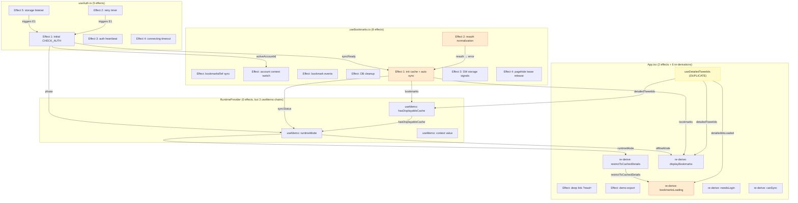
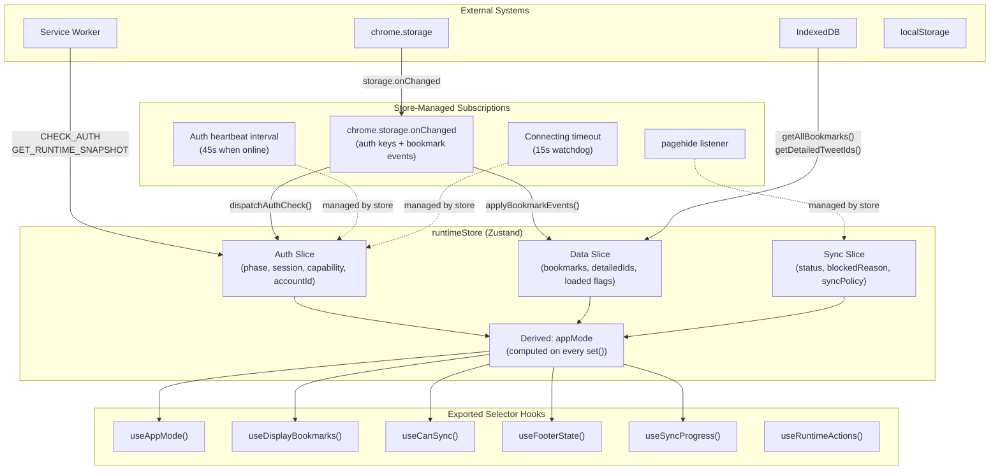

# Zustand Runtime Store Architecture

## 1. The Problem: Effect Cascade

The current architecture has **15 `useEffect` chains** across 4 files that form a cascade of state derivations. Each effect watches the output of another effect, creating race conditions and impossible-to-debug timing bugs.




The red-highlighted nodes are the direct sources of the three bugs. The yellow node is the duplicate `useDetailedTweetIds` that causes race conditions.

**The fundamental issue:** State is derived across 4 separate React components using `useEffect` and `useMemo` chains that run in unpredictable order. When `activeAccountId` or `authPhase` changes, it triggers a waterfall of effects across multiple render cycles, and the intermediate renders show incorrect UI.

---

## 2. The Solution: Single Zustand Runtime Store

Replace the entire effect cascade with a single Zustand store that:

- Owns all auth, sync, bookmark, and mode state
- Derives display state synchronously via selectors (no effects needed)
- Manages external subscriptions (chrome.storage, timers) inside the store
- Makes state transitions atomic (no intermediate renders with inconsistent state)




### Store Shape

The store lives at `[src/stores/runtime-store.ts](src/stores/runtime-store.ts)`:

```typescript
interface RuntimeStore {
  // ── Auth slice ──
  authPhase: AuthPhase;
  sessionState: SessionState;
  capability: ApiCapability;
  activeAccountId: string | null;
  hasQueryId: boolean;
  _authRetry: { delayMs: number } | null;

  // ── Data slice ──
  bookmarks: Bookmark[];
  detailedTweetIds: Set<string>;
  detailedIdsLoaded: boolean;
  bookmarksLoaded: boolean;

  // ── Sync slice ──
  syncStatus: SyncStatus;
  syncBlockedReason: SyncBlockedReason | null;
  syncPolicy: "auto" | "manual_only";
  _syncing: boolean;

  // ── Actions ──
  actions: {
    // Init (called once at store creation)
    boot: () => Promise<void>;

    // Auth
    startLogin: () => Promise<void>;

    // Sync
    sync: (options?: SyncOptions) => Promise<SyncRequestResult>;
    
    // Data management
    reset: () => Promise<void>;
    unbookmark: (tweetId: string) => Promise<{ apiError?: string }>;
    refreshDetailedIds: () => Promise<void>;

    // Cleanup
    dispose: () => void;
  };
}
```

### How `appMode` Is Computed (Selector, Not State)

`appMode` is never stored -- it is computed deterministically from the current state every time the store updates:

```typescript
type AppMode =
  | "booting"
  | "connecting"
  | "online_ready"
  | "online_degraded"
  | "offline_cached"
  | "offline_empty";

function deriveAppMode(state: RuntimeStore): AppMode {
  const { authPhase, capability, bookmarks, detailedTweetIds, detailedIdsLoaded } = state;

  if (authPhase === "loading") return "booting";
  if (authPhase === "connecting") return "connecting";

  if (authPhase === "need_login") {
    const hasReadableCache = bookmarks.length > 0 && 
      (!detailedIdsLoaded || bookmarks.some(b => detailedTweetIds.has(b.tweetId)));
    return hasReadableCache ? "offline_cached" : "offline_empty";
  }

  // authPhase === "ready"
  if (capability.bookmarksApi === "ready") return "online_ready";
  return "online_degraded";
}
```

### How `footerState` Is Computed (Selector, Not State)

This is the single place that decides what the NewTabHome footer card shows:

```typescript
type FooterState =
  | "loading"
  | "connecting"
  | "need_login"
  | "bookmark_card"
  | "syncing"
  | "sync_error"
  | "empty_ready";

function deriveFooterState(state: RuntimeStore, hasCurrentItem: boolean): FooterState {
  const mode = deriveAppMode(state);

  if (mode === "booting") return "loading";
  if (mode === "connecting") return "connecting";
  if (mode === "offline_empty") return "need_login";
  if (hasCurrentItem) return "bookmark_card";
  if (state.syncStatus === "syncing") return "syncing";
  if (state.syncStatus === "error") return "sync_error";
  return "empty_ready";
}
```

This replaces the 30+ lines of conditional rendering logic in `NewTabHome.tsx` and the `new-tab-home-state.ts` helper.

---

## 3. How Each Bug Is Fixed

### Bug 1: Reset while offline -> stuck loading

**Current:** `LS_MANUAL_SYNC_REQUIRED` blocks all DB reads. Clearing it requires a successful sync. Sync requires login. Deadlock.

**New:** `syncPolicy` is **in-memory state** in the store, not localStorage. After reset, `syncPolicy = "manual_only"`. This only blocks **auto-sync**, not DB reads. The `boot()` action always reads bookmarks from IndexedDB regardless of `syncPolicy`. When offline, the user sees "Log in to start reading" immediately because:

- `bookmarksLoaded = true` (DB read completed, returned empty)
- `authPhase = "need_login"` 
- `deriveAppMode() = "offline_empty"`
- `deriveFooterState() = "need_login"`

No deadlock possible.

### Bug 2: Login -> repeated sync button on new tabs

**Current:** `LS_MANUAL_SYNC_REQUIRED` persists in localStorage across tabs. New tabs see it and skip DB reads.

**New:** `syncPolicy` is in-memory per-tab. Each new tab starts with `syncPolicy = "auto"` (default). The `boot()` action:

1. Reads bookmarks from IndexedDB
2. If bookmarks exist, shows them immediately
3. If `authPhase === "ready"` and auto-sync is due, runs auto-sync
4. No cross-tab flags that can get stuck

### Bug 3: Spinner never stops

**Current:** `syncStatus` can get stuck at `"syncing"` if the sync operation errors in a way that skips the state machine transition.

**New:** The `sync()` action in the store uses a **guaranteed finally block** that resets `syncStatus`:

```typescript
sync: async (options) => {
  // ... sync logic ...
  try {
    set({ syncStatus: "syncing", _syncing: true });
    // ... fetch pages, update bookmarks ...
    set({ syncStatus: "idle", _syncing: false });
  } catch (err) {
    set({ syncStatus: "error", _syncing: false });
  } finally {
    // Safety: if somehow still syncing, force idle
    if (get()._syncing) {
      set({ syncStatus: "idle", _syncing: false });
    }
    // Always release lease
    await releaseActiveLease(...);
  }
}
```

---

## 4. Effect Audit: What Changes

### Effects ELIMINATED (replaced by store logic)


| Current Location   | Effect                        | Replacement                                                            |
| ------------------ | ----------------------------- | ---------------------------------------------------------------------- |
| `useAuth` E1       | Initial CHECK_AUTH            | `store.actions.boot()`                                                 |
| `useAuth` E2       | Retry timer                   | Store-internal `setTimeout` managed in `_scheduleRetry()`              |
| `useAuth` E3       | Auth heartbeat                | Store-internal `setInterval` managed in `_startHeartbeat()`            |
| `useAuth` E4       | Connecting timeout            | Store-internal `setTimeout` managed in `_startConnectingWatchdog()`    |
| `useAuth` E5       | Storage listener              | Store subscription set up in `boot()`                                  |
| `useBookmarks` E6  | bookmarksRef sync             | Not needed: store has direct access to `get().bookmarks`               |
| `useBookmarks` E7  | Account context switch        | Handled inside `_dispatchAuthResult()` when accountId changes          |
| `useBookmarks` E10 | Init cache + auto sync        | `store.actions.boot()`                                                 |
| `useBookmarks` E11 | Reauth normalization          | Handled directly in sync reducer (NO_AUTH -> "error", not "reauthing") |
| `useBookmarks` E12 | SW storage signals            | Storage listener in `boot()`                                           |
| `App.tsx` D1-D5    | 5 re-derivation chains        | Zustand selectors                                                      |
| `App.tsx` D6       | Duplicate useDetailedTweetIds | Single instance in store                                               |


### Effects KEPT (legitimate external sync)


| Location           | Effect                   | Why It Stays                                                        |
| ------------------ | ------------------------ | ------------------------------------------------------------------- |
| `useBookmarks` E9  | DB cleanup (weekly)      | One-time side effect on external system, can move to store `boot()` |
| `useBookmarks` E13 | pagehide lease release   | Browser event subscription, moves to store `boot()`                 |
| `App.tsx` E14      | Deep link `?read=` param | URL reading, stays in component                                     |
| `App.tsx` E15      | Demo export              | Debug tool, stays in component                                      |
| `NewTabHome` E1    | Wallpaper URL reset      | Component-local image loading state                                 |
| `NewTabHome` E2    | Clock interval           | Component-local timer                                               |


---

## 5. File-by-File Changes

### New files

- `[src/stores/runtime-store.ts](src/stores/runtime-store.ts)` -- The Zustand store (core of the refactor). Contains:
  - Auth state + reducer logic (from `useAuth.ts`)
  - Bookmarks state + sync logic (from `useBookmarks.ts`)
  - Sync state machine (from `sync-state-machine.ts`)
  - All timer/subscription management
  - ~400-500 lines (consolidating ~800 lines from 3 hooks)
- `[src/stores/selectors.ts](src/stores/selectors.ts)` -- Exported selector hooks following Zustand best practices:
  - `useAppMode()`, `useAuthPhase()`, `useBookmarks()`, `useDisplayBookmarks()`
  - `useSyncStatus()`, `useCanSync()`, `useSyncDisabledReason()`
  - `useRuntimeActions()` (stable actions object)
  - `useFooterState(hasCurrentItem)` -- takes current item as param, returns enum
  - ~80-100 lines

### Modified files

- `[src/runtime/RuntimeProvider.tsx](src/runtime/RuntimeProvider.tsx)` -- Simplified to just call `store.actions.boot()` on mount and `store.actions.dispose()` on unmount. No more `useAuth()`, `useBookmarks()`, `useDetailedTweetIds()`, or `useMemo` chains. Becomes ~20 lines. Could also be replaced by a simple `useEffect` in `main.tsx`.
- `[src/App.tsx](src/App.tsx)` -- Dramatically simplified:
  - Remove: `useRuntime()`, `useDetailedTweetIds()`, `usePrefetchDetails()`, `bookmarksLoading`, `displayBookmarks`, `restrictToCachedDetails`, `needsLogin`, `canSync` re-derivations
  - Replace with: `useDisplayBookmarks()`, `useAppMode()`, `useCanSync()`, `useRuntimeActions()`, `useSyncStatus()`
  - Keep: view state, selected bookmark, settings modal, toast, reading tab (component-local UI state)
  - Net reduction: ~100 lines removed
- `[src/components/NewTabHome.tsx](src/components/NewTabHome.tsx)` -- Simplified props:
  - Remove: `authPhase`, `offlineMode`, `bookmarksLoading`, `isResetting`, `canSync`, `syncDisabledReason`, `syncStatus` as separate props
  - Replace with: `footerState: FooterState`, `syncing: boolean`, `syncDisabled: boolean`, `isOffline: boolean`
  - Footer rendering becomes a simple `switch(footerState)` -- no more nested ternary chain
- `[src/components/new-tab-home-state.ts](src/components/new-tab-home-state.ts)` -- DELETE. Logic moves to `selectors.ts`.
- `[src/lib/display-bookmarks.ts](src/lib/display-bookmarks.ts)` -- Kept but only consumed by `selectors.ts`, not App.tsx.

### Unchanged files

- `[src/hooks/sync-state-machine.ts](src/hooks/sync-state-machine.ts)` -- Kept as-is (pure reducer, works perfectly inside Zustand)
- `[src/api/core/*.ts](src/api/core/)` -- Unchanged (message passing layer)
- `[src/db/index.ts](src/db/index.ts)` -- Unchanged (IndexedDB layer)
- `[public/service-worker.js](public/service-worker.js)` -- Unchanged
- All reader components, UI components, other hooks -- Unchanged

### Files that become dead code (can delete)

- `src/hooks/useAuth.ts` -- Logic moves to store
- `src/hooks/useBookmarks.ts` -- Logic moves to store (keep `useDetailedTweetIds` temporarily if needed by other consumers, but it should just read from store)

---

## 6. Scenario Walkthrough: Full State Trace

### Scenario: Logout -> Offline -> Reset -> New Tab

```
Tab 1 (before reset):
  store.authPhase = "need_login"
  store.bookmarks = [cached bookmarks]
  mode = "offline_cached"

User clicks "Reset local data":
  store.actions.reset() called:
    1. set({ bookmarks: [], syncStatus: "idle", syncPolicy: "manual_only" })
    2. resetLocalData() -- clears IndexedDB, storage
    3. window.location.reload()

Tab 2 (new tab after reset):
  Store created fresh (module-level singleton per tab):
    authPhase = "loading", bookmarks = [], syncStatus = "loading"
    
  store.actions.boot() called:
    Step 1: getRuntimeSnapshot() from service worker
      → sessionState = "logged_out" (auth keys preserved during reset)
      → set({ authPhase: "need_login", sessionState: "logged_out", activeAccountId: "preserved" })
      
    Step 2: getAllBookmarks() from IndexedDB
      → DB was deleted, returns []
      → set({ bookmarks: [], bookmarksLoaded: true })
      
    Step 3: getDetailedTweetIds() from IndexedDB
      → DB was deleted, returns empty Set
      → set({ detailedTweetIds: new Set(), detailedIdsLoaded: true })
      
    Step 4: No auto-sync (authPhase !== "ready")
      → set({ syncStatus: "idle" })

  Final state:
    authPhase = "need_login"
    bookmarks = []
    bookmarksLoaded = true
    detailedIdsLoaded = true
    syncStatus = "idle"
    
  deriveAppMode() = "offline_empty"
  deriveFooterState() = "need_login"
  
  UI shows: "Log in to start reading" with login button
```

### Scenario: Login -> Sync -> New Tab -> Works Immediately

```
Tab 1 (user logs in on X, comes back to new tab):
  Storage listener fires (auth keys changed)
  → store._dispatchAuthCheck()
  → getRuntimeSnapshot() → logged_in, bookmarksApi: "ready"
  → set({ authPhase: "ready", sessionState: "logged_in" })
  
  mode = "online_ready", footerState = "empty_ready"
  UI shows: "Your reading list is quiet" + "Sync bookmarks" button
  
  User clicks "Sync bookmarks":
  → store.actions.sync({ trigger: "manual" })
  → set({ syncStatus: "syncing" })
  → Pages fetched, bookmarks upserted into IndexedDB + store
  → set({ syncStatus: "idle", bookmarks: [...fetched] })
  → store.actions.refreshDetailedIds()
  
  UI shows: bookmark card

Tab 2 (new tab):
  store.actions.boot() called:
    Step 1: auth → "ready"
    Step 2: getAllBookmarks() → returns bookmarks from IndexedDB
      → set({ bookmarks: [...], bookmarksLoaded: true })
    Step 3: getDetailedTweetIds() → returns cached IDs
      → set({ detailedTweetIds: Set([...]), detailedIdsLoaded: true })
    Step 4: auto-sync check → fresh cache (synced recently) → skip
      → set({ syncStatus: "idle" })
  
  mode = "online_ready"
  displayBookmarks = all bookmarks (not restricted)
  footerState = "bookmark_card"
  
  UI shows: bookmark card immediately. No sync button prompt.
```

---

## 7. Implementation Order

The refactor is done in 5 sequential steps, each producing a working build:

1. **Install Zustand + create store skeleton** -- Add `zustand` dependency. Create `runtime-store.ts` with the state shape and stub actions. Create `selectors.ts` with all selector hooks. No behavior yet, just types and structure.
2. **Port auth logic into store** -- Move all logic from `useAuth.ts` into store actions (`boot`, `_dispatchAuthCheck`, `_scheduleRetry`, `_startHeartbeat`, `_startConnectingWatchdog`). Wire up `chrome.storage.onChanged` listener inside `boot()`. Verify auth phase transitions work.
3. **Port bookmarks + sync logic into store** -- Move `useBookmarks` logic into store. The `sync()` action, bookmark event processing, account context switching, lease management. Wire up the sync state machine. Remove `LS_MANUAL_SYNC_REQUIRED` in favor of in-memory `syncPolicy`.
4. **Wire up components** -- Update `RuntimeProvider` to just call `boot()`/`dispose()`. Update `App.tsx` to use selector hooks instead of `useRuntime()` + re-derivations. Update `NewTabHome` to receive `FooterState` enum.
5. **Delete dead code + test** -- Remove `useAuth.ts`, `useBookmarks.ts` (or keep as thin re-exports from store), `new-tab-home-state.ts`. Run existing tests. Manual verification of all scenarios from the verification matrix.

