# Totem Architecture

Chrome extension (Manifest V3, React 19 + TypeScript) that syncs X bookmarks into an offline reading experience.

This document reflects the current runtime architecture:

- Service worker owns session, capability, and sync admission truth.
- IndexedDB owns persisted bookmark, detail, reading-progress, and highlight data.
- A private Zustand runtime store owns UI/runtime truth for the new-tab app.
- Components render from selectors, not from ad-hoc auth/sync flags.

## 1. System Overview

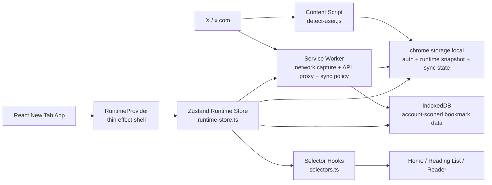

### Layer responsibilities

| Layer | Owns | Does not own |
|---|---|---|
| Service worker | auth/session snapshot, query ID discovery, sync reservation/cooldown/in-flight policy | UI mode, bookmark rendering |
| IndexedDB | durable bookmark metadata, tweet details, reading progress, highlights | auth/session truth |
| Runtime store | boot sequencing, runtime mode, sync UI state, selector outputs, reader/prefetch coordination | network interception, durable sync policy |
| Components | rendering and local interaction state | business logic for auth/sync/offline mode |

## 2. Runtime Architecture

The previous hook cascade is gone. The new-tab app now has one runtime store and one thin provider.

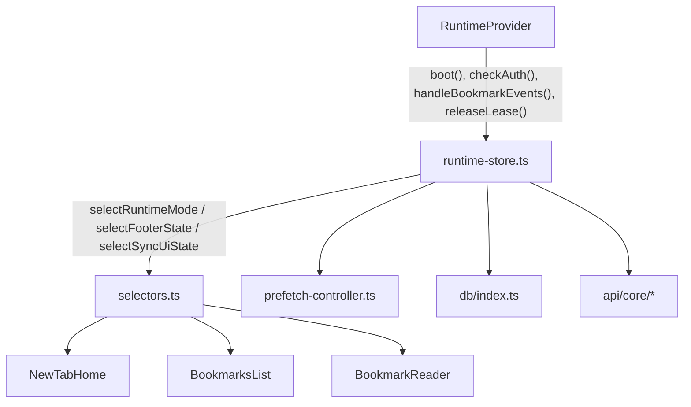

### RuntimeProvider

`src/runtime/RuntimeProvider.tsx` is intentionally small. It only manages external side effects:

- boot on mount
- heartbeat while auth is ready
- auth retry timer
- connecting watchdog
- `chrome.storage.onChanged`
- `pagehide` lease release

It does **not** derive UI mode.

### Runtime store

`src/stores/runtime-store.ts` owns the runtime state for the new tab:

- auth/session state
- account context
- hydration flags
- bookmark and detail-cache state
- sync status and sync job kind
- boot policy after reset
- generation guards for boot and sync
- reader active state
- prefetch status

### Selector surface

Components read selector hooks from `src/stores/selectors.ts`, for example:

- `useAppMode()`
- `useDisplayBookmarks()`
- `useSyncUiState()`
- `useSyncButtonState()`
- `useFooterState()`
- `useReaderAvailabilityState()`
- `useRuntimeActions()`

The raw store hook is private to the runtime module.

## 3. Runtime State Model

### Internal runtime modes

The runtime store derives one internal mode:

- `initializing`
- `connecting`
- `offline_empty`
- `offline_cached`
- `online_blocked`
- `online_ready`

This mode is not the full UI contract. UI consumes more specific selectors such as footer state and sync button state.

### Core runtime state

| Field group | Examples | Why it exists |
|---|---|---|
| Auth | `authPhase`, `authState`, `sessionState`, `capability`, `activeAccountId`, `hasQueryId` | runtime truth from service worker |
| Hydration | `bookmarksLoaded`, `detailedIdsLoaded` | prevents false loading/offline states |
| Data | `bookmarks`, `detailedTweetIds` | bookmark list + offline-readable detail index |
| Sync | `syncStatus`, `syncJobKind`, `syncBlockedReason` | separates blocking bootstrap from background work |
| Reset/seed policy | `bootPolicy` | controls post-reset startup and incomplete initial imports |
| Safety | `bootGeneration`, `syncGeneration` | ignores stale async completions |
| Reader/prefetch | `readerActive`, `prefetchStatus` | controls offline detail warmup |

### Important invariants

- Account context must be set before any IndexedDB read.
- `initializing` ends only after auth and hydration have settled, unless reset policy explicitly short-circuits logged-out boot.
- `bootstrap` with visible content normalizes to `backfill`.
- `logged_out` can never remain in `authPhase = "ready"`.
- Components should not branch directly on raw `authPhase`, `syncStatus`, or `bootPolicy`.

## 4. Boot Sequence

Boot is centralized in `runtime-store.ts`.

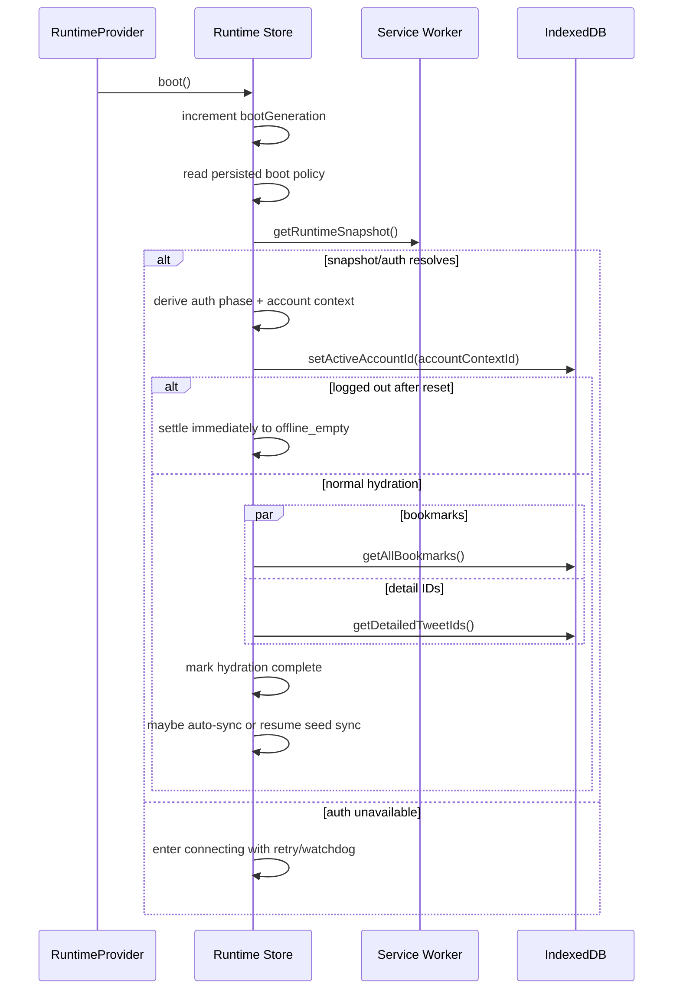

### Why boot is generation-safe

Each boot increments `bootGeneration`. Any async auth or hydration result from an older generation is ignored. This prevents:

- StrictMode double-mount stale writes
- old auth checks writing after reset
- account-switch hydration poisoning the current tab

## 5. Authentication and Capability

Totem depends on three pieces from X:

- user/account context
- auth headers/session
- bookmark API query ID / capability readiness

The service worker builds a runtime snapshot. The runtime store converts that snapshot into app-facing auth state.

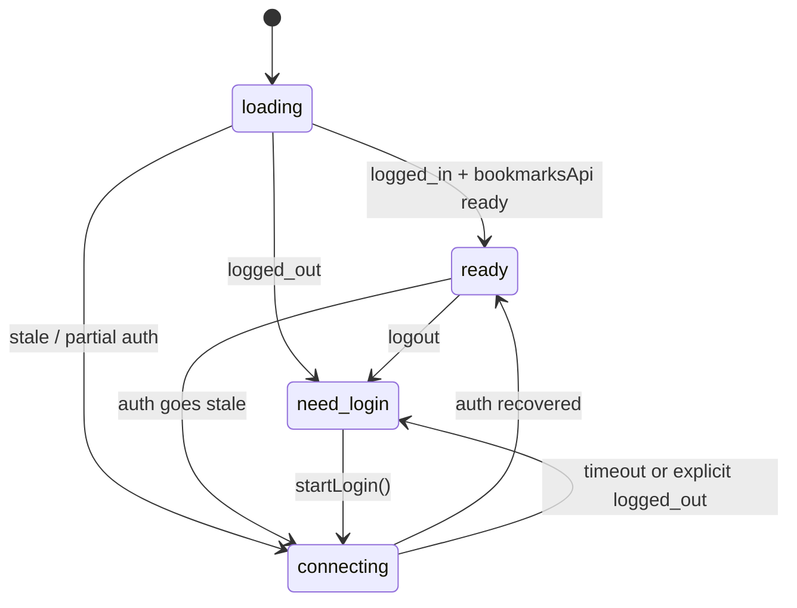

### Meaning of online states

- `online_ready`: user is logged in and bookmark API is usable
- `online_blocked`: user exists, but bookmark API/query ID is not ready yet

This is why the app can show a "finish X setup" style state instead of a misleading sync CTA.

## 6. Sync Architecture

The runtime store never syncs "whenever it feels like it". Every sync attempt first reserves permission through the service worker.

### Reservation model

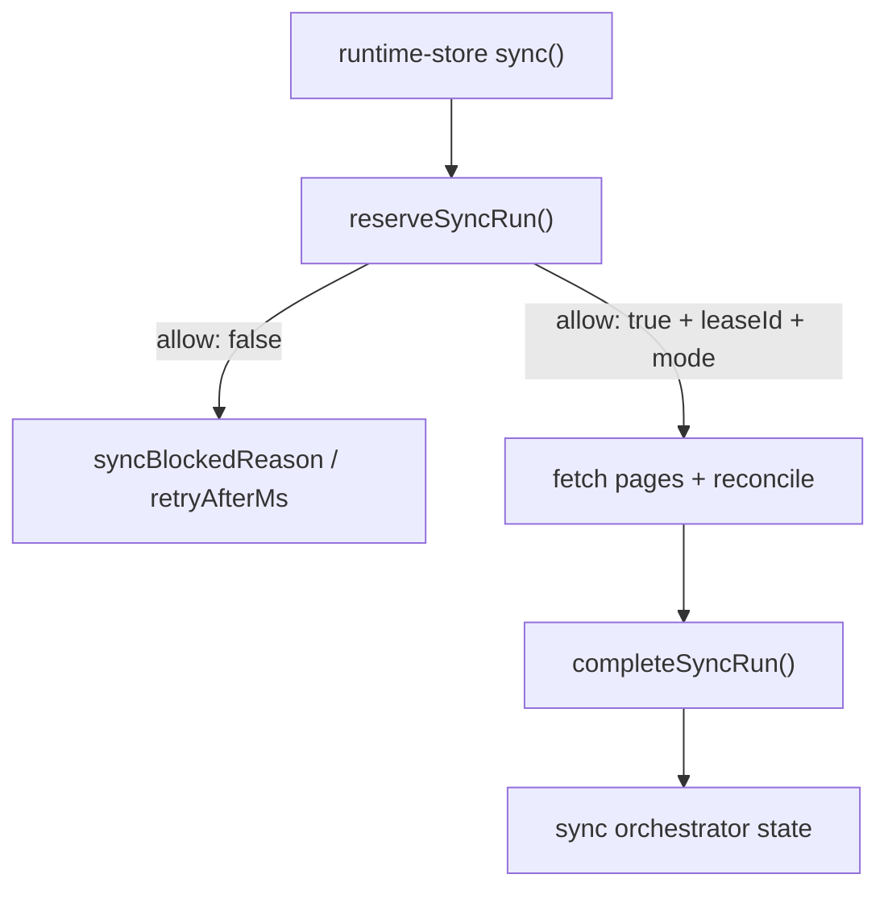

### Sync modes

Worker/orchestrator modes:

- `full`
- `incremental`
- `quick`

Runtime UI job kinds:

- `bootstrap`: blocking only while no visible content exists
- `backfill`: non-blocking once content is visible

These are intentionally different concepts:

- worker mode controls how much remote work is attempted
- job kind controls how the UI behaves while that work runs

### Bootstrap vs backfill

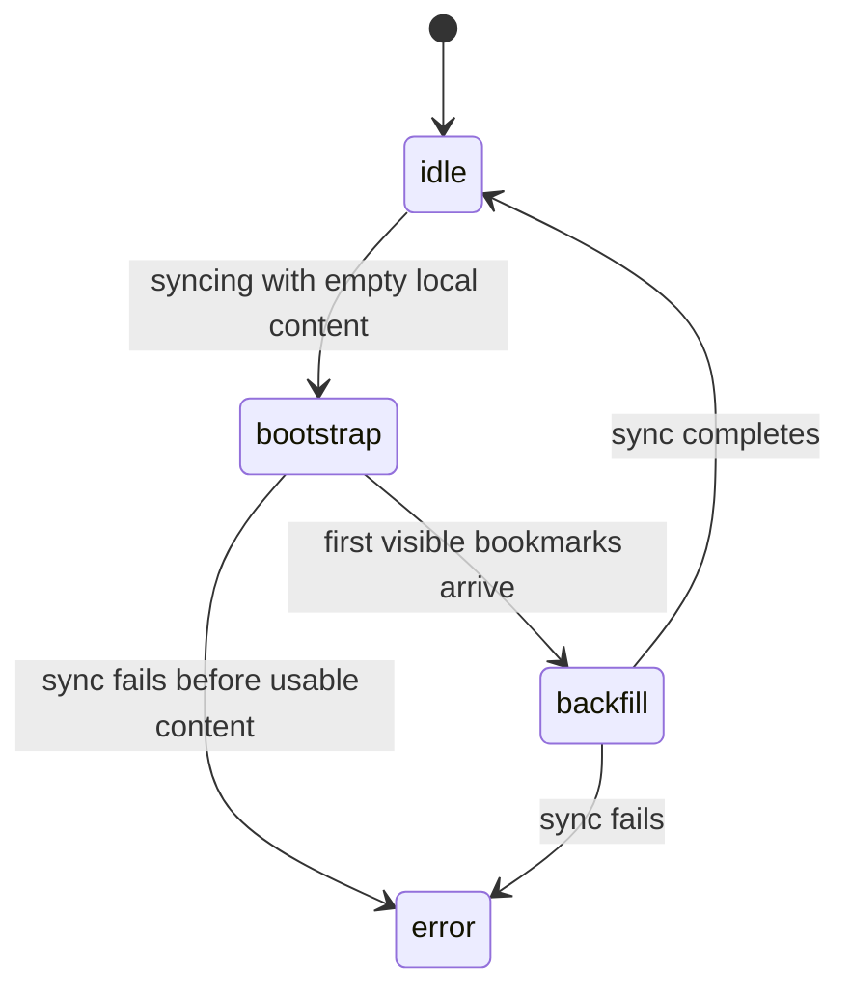

### Reconcile behavior

`src/lib/reconcile.ts` walks bookmark pages and reports:

- new bookmarks
- stale local IDs
- termination reason
- recovery hint when X returns one full page (100) with no cursor

The runtime store merges each page into state immediately, then persists it to IndexedDB.

## 7. Incomplete Initial Seed Handling

This is the most important post-reset edge case.

### Problem

X can sometimes return exactly 100 bookmarks with no continuation cursor. That looks like a successful first page, but it is not a complete import.

### Current behavior

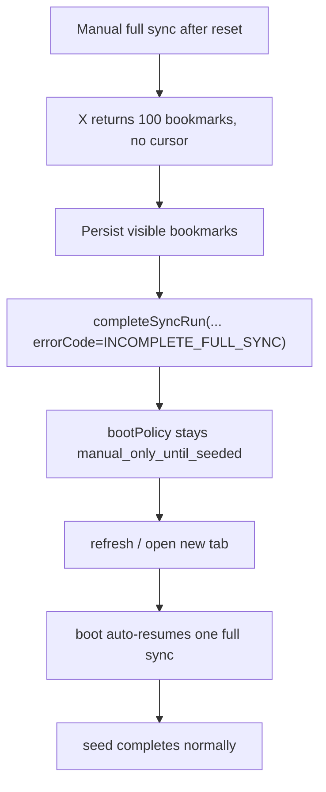

### Rules

- visible bookmarks are kept
- seed policy is not cleared
- manual failure cooldown is **not** applied for `INCOMPLETE_FULL_SYNC`
- on the next boot, if:
  - boot policy is still `manual_only_until_seeded`
  - bookmarks already exist
  - user is logged in
  - bookmark API is ready
- then the runtime automatically resumes one `full` sync for that boot

This preserves the simple user journey:

1. reset
2. log in
3. click sync once
4. if X flakes, partial bookmarks stay visible
5. refresh/new tab continues the import automatically

## 8. Bookmark Events

The service worker captures create/delete bookmark events from X and persists them into `chrome.storage.local`.

The runtime store processes them through `handleBookmarkEvents()`.

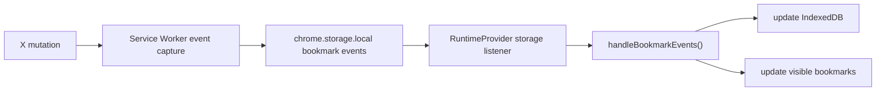

### Important detail

Seed mode no longer suppresses bookmark events. Post-reset seeding blocks auto-sync policy, not normal event ingestion.

## 9. Detail Cache and Reader Flow

Bookmarks alone are not enough for offline reading. The reader and prefetch loop both contribute to the same detail-cache index.

### Reader flow

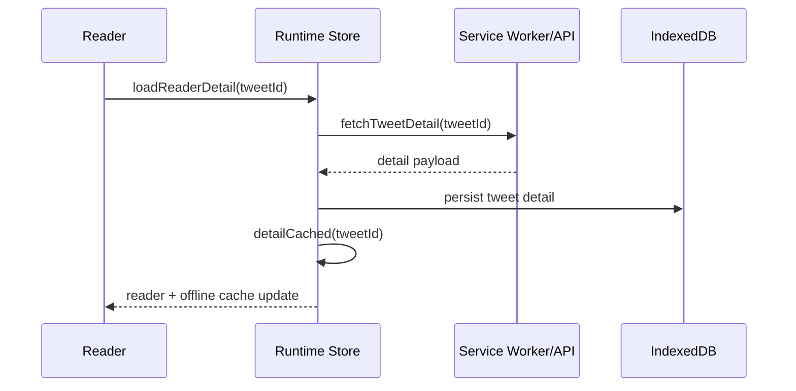

`detailCached(tweetId)` updates the in-memory `detailedTweetIds` set immediately so offline filtering stays correct without waiting for a later refresh.

### Offline-readable bookmarks

When the app is offline or reconnecting, visible bookmarks are restricted to bookmarks with cached details:

- online: show all bookmarks
- offline/connecting/reauthing: show only bookmarks whose `tweetId` exists in `detailedTweetIds`

## 10. Prefetch Controller

Prefetch loop mechanics live in `src/stores/prefetch-controller.ts`, not inside the store itself.

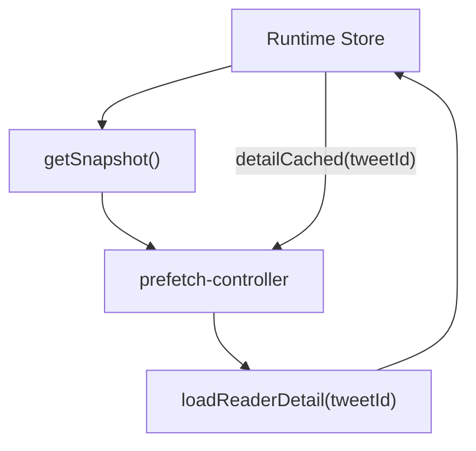

### Prefetch rules

- only runs when runtime mode is `online_ready`
- pauses while reader is active
- prioritizes a small top-of-list pool
- continues after item-level failures
- updates `prefetchStatus` as `idle`, `running`, or `paused`

## 11. Persistence

### IndexedDB

Totem uses account-scoped databases.

| Store | Purpose |
|---|---|
| `bookmarks` | synced bookmark metadata |
| `tweet_details` | full reader payload for offline reading |
| `reading_progress` | resume position + completion |
| `highlights` | saved highlights and notes |

Database naming:

- default DB: `totem`
- account DB: `totem_acct_<accountId>`

The runtime store calls `setActiveAccountId(accountContextId)` before hydration so it opens the correct database.

### chrome.storage.local

Used for:

- auth/session capture
- runtime snapshot from service worker
- sync orchestrator state
- bookmark event queue
- last sync timestamps
- runtime audit and cache summary

### localStorage

Used sparingly for app-local state, including:

- `totem_boot_sync_policy`

Boot policies:

- `auto`
- `manual_only_until_seeded`

## 12. Reset Flow

Reset is intentionally split between runtime preparation and durable storage cleanup.

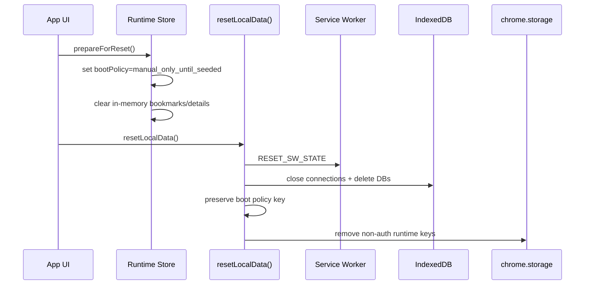

### Reset goals

- keep auth capture when possible so login recovery is cheaper
- clear local bookmark/detail/progress/highlight state
- preserve boot policy so the next boot knows reset happened
- prevent the logged-out post-reset flow from blocking forever on hydration

### Logged-out reset shortcut

If boot policy is `manual_only_until_seeded` and auth resolves to logged out, boot settles directly to `offline_empty` instead of waiting on cache hydration. This avoids the old "loading forever after reset" failure mode.

## 13. Component Rendering Rules

The main app-level rule is simple:

> Components render from selector answers, not by reconstructing runtime truth locally.

Examples:

- `NewTabHome` uses `useFooterState()` and `useSyncButtonState()`
- `BookmarksList` uses the same sync selectors as the home screen
- `BookmarkReader` uses `useReaderAvailabilityState()`
- bookmark lists use `useDisplayBookmarks()`

This keeps home, reading list, and reader aligned.

## 14. Key Files

### Runtime and UI state

- `src/stores/runtime-store.ts`
- `src/stores/selectors.ts`
- `src/runtime/RuntimeProvider.tsx`
- `src/stores/prefetch-controller.ts`

### Service worker and API boundary

- `public/service-worker.js`
- `src/api/core/auth.ts`
- `src/api/core/bookmarks.ts`
- `src/api/core/posts.ts`
- `src/api/core/sync.ts`

### Persistence

- `src/db/index.ts`
- `src/lib/reset.ts`
- `src/lib/storage-keys.ts`

### Sync helpers

- `src/lib/reconcile.ts`
- `src/lib/fetch-queue.ts`
- `src/lib/bookmark-event-plan.ts`

### Components

- `src/App.tsx`
- `src/components/NewTabHome.tsx`
- `src/components/BookmarksList.tsx`
- `src/components/BookmarkReader.tsx`

## 15. Mental Model

If you need one sentence for the whole system, use this:

> The service worker decides whether Totem is allowed to sync, IndexedDB remembers what Totem already knows, and the runtime store decides what the UI should show right now.

That split is the backbone of the current architecture.
