# Totem Architecture

Chrome extension (Manifest V3, React 19 + TypeScript) that syncs X bookmarks into an offline reading experience.

This document reflects the current runtime architecture:

- Service worker owns session, capability, and sync admission truth.
- IndexedDB owns persisted bookmark, detail, reading-progress, and highlight data.
- A private Zustand runtime store owns UI/runtime truth for the new-tab app.
- Components render from selectors, not from ad-hoc auth/sync flags.

## 1. System Overview

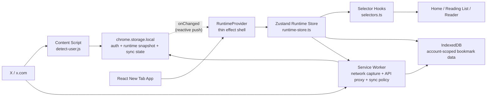
```mermaid
flowchart LR
  X["X / x.com"] --> CS["Content Script<br/>detect-user.js"]
  X --> SW["Service Worker<br/>network capture + API proxy + sync policy"]
  CS --> CL["chrome.storage.local<br/>auth + runtime snapshot + sync state"]
  SW --> CL
  SW --> IDB["IndexedDB<br/>account-scoped bookmark data"]
  APP["React New Tab App"] --> RP["RuntimeProvider<br/>thin effect shell"]
  RP --> STORE["Zustand Runtime Store<br/>runtime-store.ts"]
  STORE --> SEL["Selector Hooks<br/>selectors.ts"]
  SEL --> UI["Home / Reading List / Reader"]
  STORE --> IDB
  STORE --> SW
  CL -.->|"onChanged<br/>(reactive push)"| RP
```

### Writer ownership (single writer per persisted fact)

Each durable piece of state has exactly one writer. Everyone else reads. This is the invariant that fixes the "loading loop on every reload" bug class — see §16 Invariant #1.

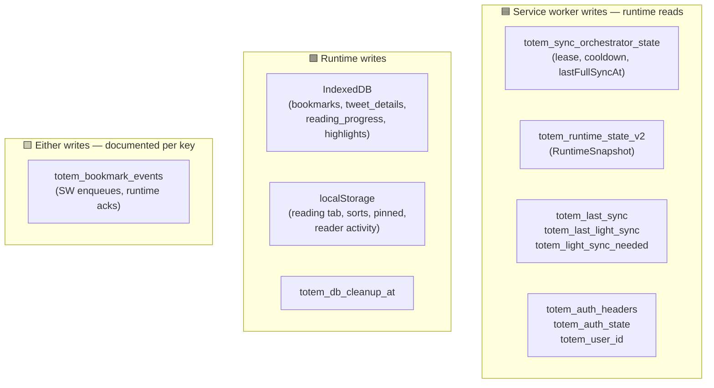
```mermaid
flowchart TB
  subgraph SW_OWNED["🟦 Service worker writes — runtime reads"]
    direction LR
    ORCH["totem_sync_orchestrator_state<br/>(lease, cooldown, lastFullSyncAt)"]
    RTV2["totem_runtime_state_v2<br/>(RuntimeSnapshot)"]
    LS["totem_last_sync<br/>totem_last_light_sync<br/>totem_light_sync_needed"]
    AUTH_W["totem_auth_headers<br/>totem_auth_state<br/>totem_user_id"]
  end

  subgraph RT_OWNED["🟩 Runtime writes"]
    direction LR
    IDB_RW["IndexedDB<br/>(bookmarks, tweet_details,<br/>reading_progress, highlights)"]
    LSO["localStorage<br/>(reading tab, sorts, pinned,<br/>reader activity)"]
    CLEAN["totem_db_cleanup_at"]
  end

  subgraph SHARED["🟨 Either writes — documented per key"]
    direction LR
    BE["totem_bookmark_events<br/>(SW enqueues, runtime acks)"]
  end
```

### Layer responsibilities

| Layer | Owns | Does not own |
|---|---|---|
| Service worker | auth/session snapshot, query ID discovery, sync reservation/cooldown/in-flight policy, `lastFullSyncAt` | UI mode, bookmark rendering |
| IndexedDB | durable bookmark metadata, tweet details, reading progress, highlights | auth/session truth |
| Runtime store | boot sequencing, runtime mode, sync UI state, selector outputs, reader/prefetch coordination | any persisted flag that answers "am I seeded" |
| Components | rendering and local interaction state | business logic for auth/sync/offline mode |

## 2. Runtime Architecture

The previous hook cascade is gone. The new-tab app now has one runtime store and one thin provider.

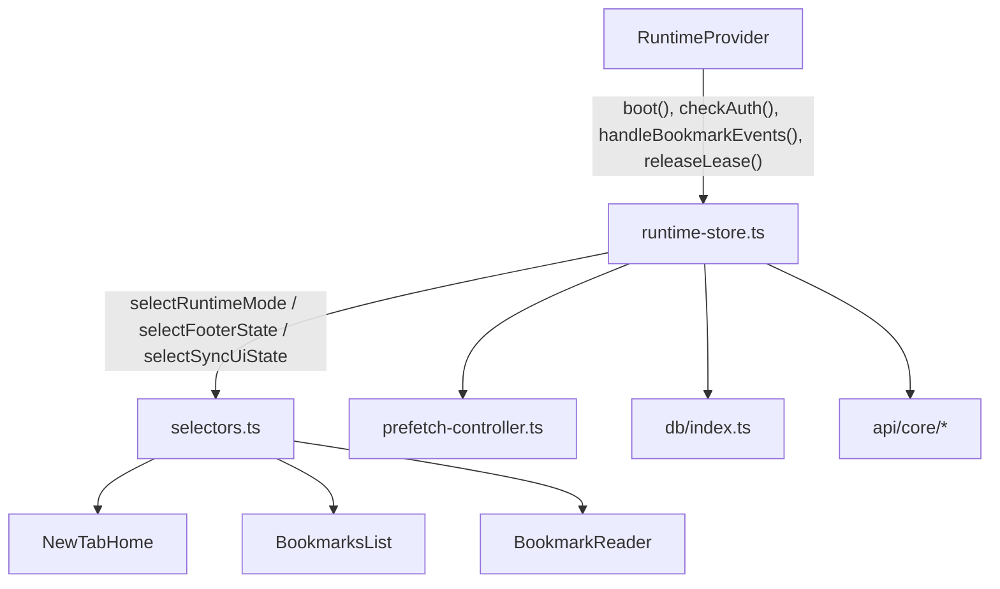
```mermaid
flowchart TD
  RP["RuntimeProvider"] -->|"boot(), checkAuth(), handleBookmarkEvents(), releaseLease()"| STORE["runtime-store.ts"]
  STORE -->|"selectRuntimeMode / selectFooterState / selectSyncUiState"| SEL["selectors.ts"]
  SEL --> HOME["NewTabHome"]
  SEL --> LIST["BookmarksList"]
  SEL --> READER["BookmarkReader"]
  STORE --> PREFETCH["prefetch-controller.ts"]
  STORE --> DB["db/index.ts"]
  STORE --> API["api/core/*"]
```

### RuntimeProvider

`src/runtime/RuntimeProvider.tsx` is intentionally small. It only manages external side effects:

- boot on mount
- heartbeat while auth is ready
- auth retry timer
- connecting watchdog
- `chrome.storage.onChanged`
- `pagehide` lease release

It does **not** derive UI mode.

### Runtime store

`src/stores/runtime-store.ts` owns the runtime state for the new tab:

- auth/session state
- account context
- hydration flags
- bookmark and detail-cache state
- sync status and sync job kind
- boot policy after reset
- generation guards for boot and sync
- reader active state
- prefetch status

### Selector surface

Components read selector hooks from `src/stores/selectors.ts`, for example:

- `useAppMode()`
- `useDisplayBookmarks()`
- `useSyncUiState()`
- `useSyncButtonState()`
- `useFooterState()`
- `useReaderAvailabilityState()`
- `useRuntimeActions()`

The raw store hook is private to the runtime module.

## 3. Runtime State Model

### Internal runtime modes

The runtime store derives one internal mode:

- `initializing`
- `connecting`
- `offline_empty`
- `offline_cached`
- `online_blocked`
- `online_ready`

This mode is not the full UI contract. UI consumes more specific selectors such as footer state and sync button state.

### Core runtime state

| Field group | Examples | Why it exists |
|---|---|---|
| Auth | `authPhase`, `authState`, `sessionState`, `capability`, `activeAccountId` | runtime mirror of SW snapshot; never persisted by the runtime |
| Hydration | `bookmarksLoaded`, `detailedIdsLoaded` | prevents false loading/offline states |
| Data | `bookmarks`, `detailedTweetIds` | bookmark list + offline-readable detail index |
| Sync | `syncStatus`, `syncJobKind`, `syncBlockedReason` | separates blocking bootstrap from background work |
| Safety | `bootGeneration`, `syncGeneration` | ignores stale async completions |
| Reader/prefetch | `readerActive`, `prefetchStatus` | controls offline detail warmup |

> **Note:** there is no runtime-side "seeded" flag. "Has this account ever completed a full sync?" is derived from the SW-owned `snapshot.accounts[id].lastFullSyncAt > 0`. See §16 Invariant #2.

### Important invariants

- Account context must be set before any IndexedDB read.
- `initializing` ends only after auth and hydration have settled. There are no early-exit shortcuts.
- `bootstrap` with visible content normalizes to `backfill`.
- `logged_out` can never remain in `authPhase = "ready"`.
- Components should not branch directly on raw `authPhase` or `syncStatus`; they consume selectors (§13).

## 4. Boot Sequence

Boot is centralized in `runtime-store.ts`. It is linear: no branches based on a persisted "am I seeded" flag.

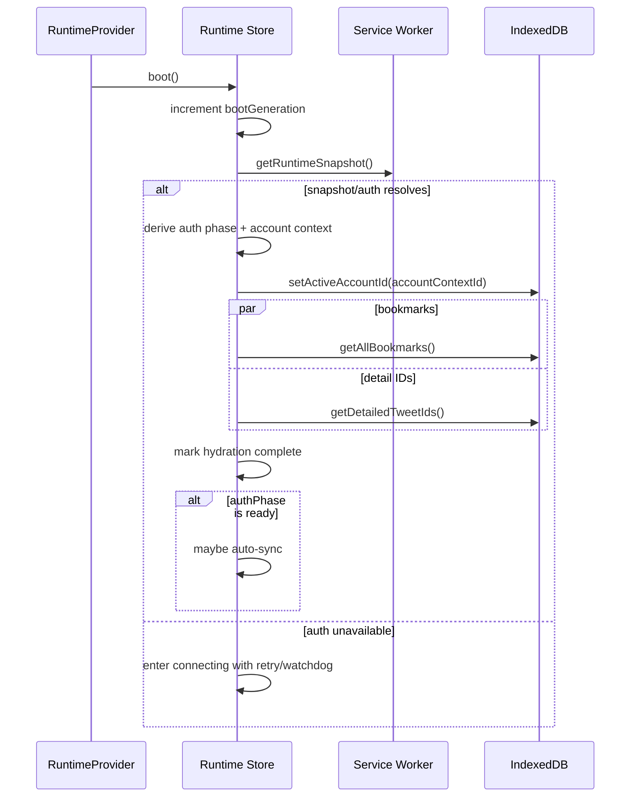
```mermaid
sequenceDiagram
  participant UI as RuntimeProvider
  participant Store as Runtime Store
  participant SW as Service Worker
  participant DB as IndexedDB

  UI->>Store: boot()
  Store->>Store: increment bootGeneration
  Store->>SW: getRuntimeSnapshot()
  alt snapshot/auth resolves
    Store->>Store: derive auth phase + account context
    Store->>DB: setActiveAccountId(accountContextId)
    par bookmarks
      Store->>DB: getAllBookmarks()
    and detail IDs
      Store->>DB: getDetailedTweetIds()
    end
    Store->>Store: mark hydration complete
    alt authPhase is ready
      Store->>Store: maybe auto-sync
    end
  else auth unavailable
    Store->>Store: enter connecting with retry/watchdog
  end
```

**What is deliberately absent from this diagram:**

- No "read persisted boot policy" step — the runtime no longer stores one.
- No "logged-out shortcut" branch — every boot reads IDB. The old shortcut silently wiped cached bookmarks on transient `need_login` and was the root of the post-reset loading loop.
- No "resume seed sync" branch — `maybe auto-sync` handles both first-boot and recovery cases uniformly; the SW decides mode via self-heal (§6).

### Why boot is generation-safe

Each boot increments `bootGeneration`. Any async auth or hydration result from an older generation is ignored. This prevents:

- StrictMode double-mount stale writes
- old auth checks writing after reset
- account-switch hydration poisoning the current tab

## 5. Authentication and Capability

Totem depends on three pieces from X:

- user/account context
- auth headers/session
- bookmark API query ID / capability readiness

The service worker builds a runtime snapshot. The runtime store converts that snapshot into app-facing auth state.

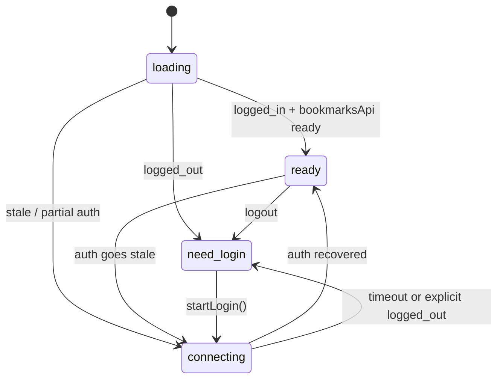
```mermaid
stateDiagram-v2
  [*] --> loading
  loading --> ready: logged_in + bookmarksApi ready
  loading --> connecting: stale / partial auth
  loading --> need_login: logged_out
  connecting --> ready: auth recovered
  connecting --> need_login: timeout or explicit logged_out
  ready --> need_login: logout
  ready --> connecting: auth goes stale
  need_login --> connecting: startLogin()
```

### Meaning of online states

- `online_ready`: user is logged in and bookmark API is usable
- `online_blocked`: user exists, but bookmark API/query ID is not ready yet

This is why the app can show a "finish X setup" style state instead of a misleading sync CTA.

## 6. Sync Architecture

The runtime store never syncs "whenever it feels like it". Every sync attempt first reserves permission through the service worker.

### Reservation model

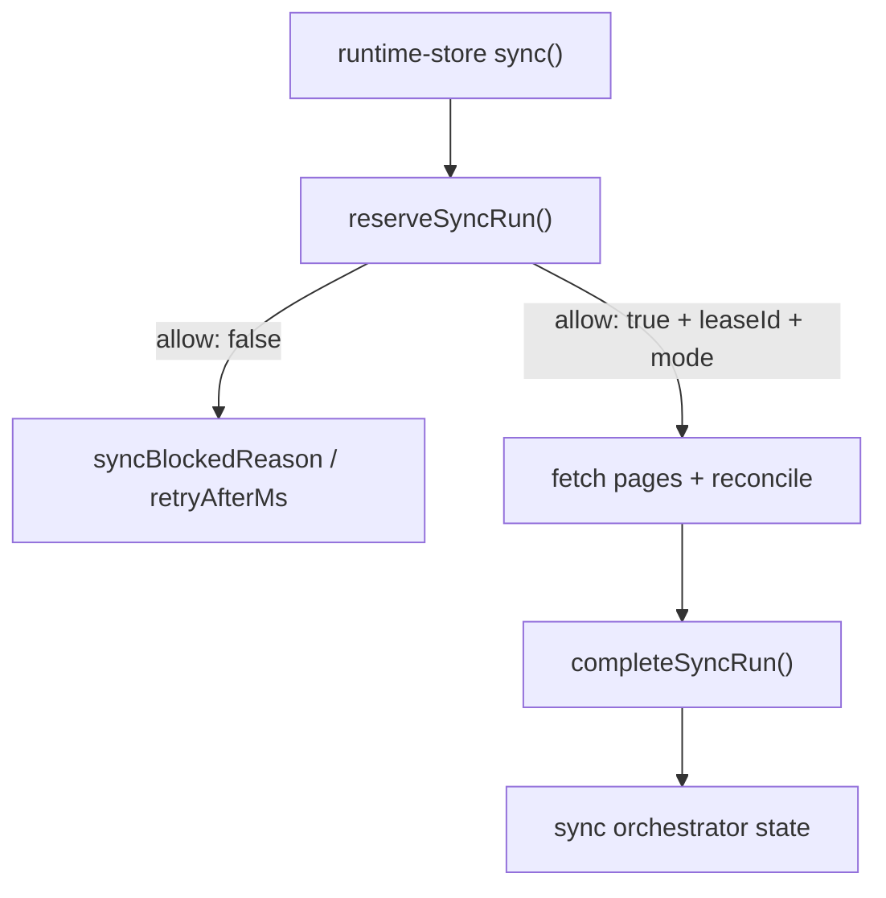
```mermaid
flowchart TD
  Store["runtime-store sync()"] --> Reserve["reserveSyncRun()"]
  Reserve -->|"allow: false"| Blocked["syncBlockedReason / retryAfterMs"]
  Reserve -->|"allow: true + leaseId + mode"| Run["fetch pages + reconcile"]
  Run --> Complete["completeSyncRun()"]
  Complete --> WorkerState["sync orchestrator state"]
```

### Sync modes

Worker/orchestrator modes:

- `full`
- `incremental`
- `quick` (defined in the type but currently unused by the self-heal selector)

Runtime UI job kinds:

- `bootstrap`: blocking only while no visible content exists
- `backfill`: non-blocking once content is visible

These are intentionally different concepts:

- worker mode controls how much remote work is attempted
- job kind controls how the UI behaves while that work runs

### How the orchestrator picks mode (self-heal)

Mode is derived purely from the orchestrator's own state. The caller cannot request a mode — the `requestedMode` parameter was removed so the runtime can't express a wrong thing. The decision lives in `src/service-worker/sync.ts` `handleSyncPolicyReserve`:

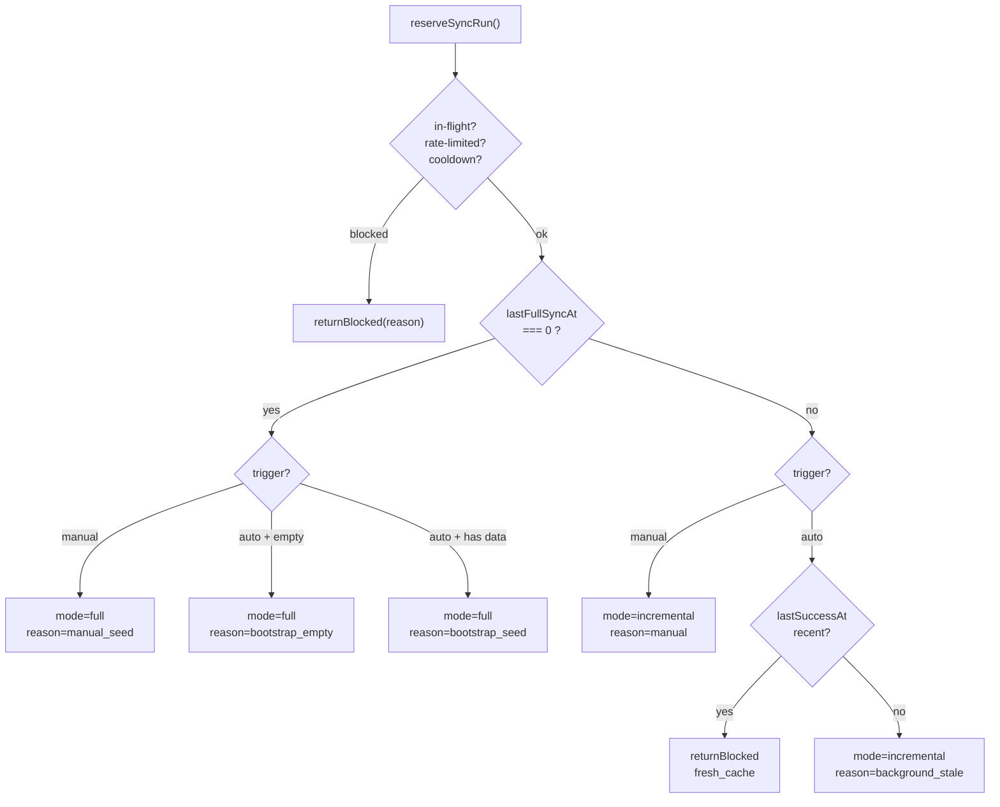
```mermaid
flowchart TD
  Start["reserveSyncRun()"] --> Guards{"in-flight?<br/>rate-limited?<br/>cooldown?"}
  Guards -->|blocked| Return["returnBlocked(reason)"]
  Guards -->|ok| NeedFull{"lastFullSyncAt<br/>=== 0 ?"}
  NeedFull -->|yes| Trigger1{trigger?}
  NeedFull -->|no| Trigger2{trigger?}
  Trigger1 -->|manual| FullSeed["mode=full<br/>reason=manual_seed"]
  Trigger1 -->|auto + empty| FullBootstrap["mode=full<br/>reason=bootstrap_empty"]
  Trigger1 -->|auto + has data| FullSeedBS["mode=full<br/>reason=bootstrap_seed"]
  Trigger2 -->|manual| Inc1["mode=incremental<br/>reason=manual"]
  Trigger2 -->|auto| FreshCheck{lastSuccessAt<br/>recent?}
  FreshCheck -->|yes| FreshBlock["returnBlocked<br/>fresh_cache"]
  FreshCheck -->|no| Inc2["mode=incremental<br/>reason=background_stale"]
```

**Why this matters:** `lastFullSyncAt === 0` means "this orchestrator has never recorded a completed full sync for this account." The next run is therefore full, regardless of what the runtime's IDB currently holds. If a previous install's IDB is still on disk but the SW state was wiped (extension reinstall, profile migration, `RESET_SW_STATE`), the full reconcile walks pages against the existing `localIds` set, deduplicates, and confirms completeness in one pass. No wasted downloads; no stuck state.

### Bootstrap vs backfill

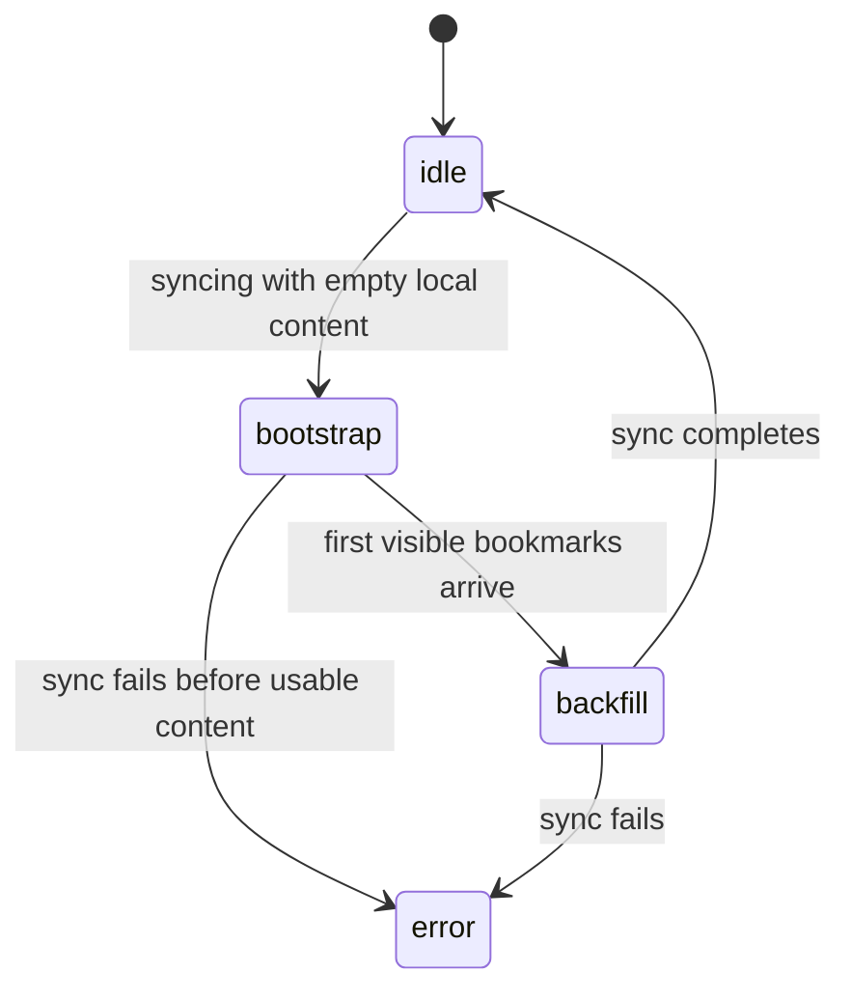
```mermaid
stateDiagram-v2
  [*] --> idle
  idle --> bootstrap: syncing with empty local content
  bootstrap --> backfill: first visible bookmarks arrive
  bootstrap --> error: sync fails before usable content
  backfill --> idle: sync completes
  backfill --> error: sync fails
```

### Reconcile behavior

`src/lib/reconcile.ts` walks bookmark pages and reports:

- new bookmarks
- stale local IDs
- termination reason
- recovery hint when X returns one full page (100) with no cursor

The runtime store merges each page into state immediately, then persists it to IndexedDB.

## 7. Incomplete Initial Seed Handling

The most important post-reset edge case, now handled by self-heal instead of a persisted flag.

### Problem

X can sometimes return exactly 100 bookmarks with no continuation cursor. That looks like a successful first page, but it is not a complete import.

### Current behavior

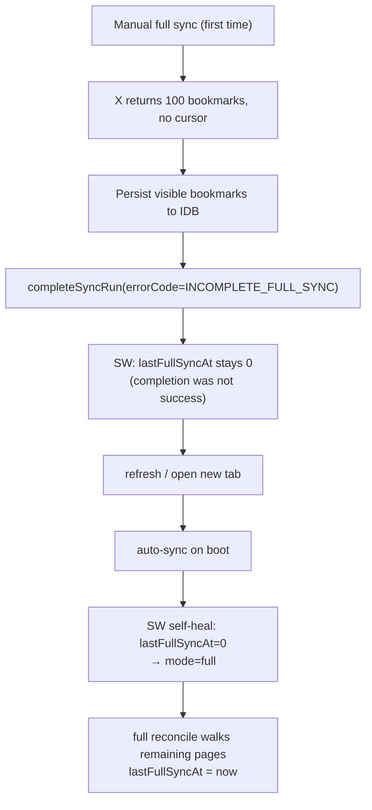
```mermaid
flowchart TD
  ManualSync["Manual full sync (first time)"] --> Page100["X returns 100 bookmarks, no cursor"]
  Page100 --> Persist["Persist visible bookmarks to IDB"]
  Persist --> MarkIncomplete["completeSyncRun(errorCode=INCOMPLETE_FULL_SYNC)"]
  MarkIncomplete --> KeepRaw["SW: lastFullSyncAt stays 0<br/>(completion was not success)"]
  KeepRaw --> Reload["refresh / open new tab"]
  Reload --> NextSync["auto-sync on boot"]
  NextSync --> SelfHeal["SW self-heal: lastFullSyncAt=0<br/>→ mode=full"]
  SelfHeal --> Complete["full reconcile walks remaining pages<br/>lastFullSyncAt = now"]
```

### Rules

- Visible bookmarks are kept locally (IDB) even when the full reconcile is incomplete.
- `lastFullSyncAt` is only set to `now` when `handleSyncPolicyComplete` sees `status === "success"` with `mode === "full"` — so `INCOMPLETE_FULL_SYNC` (treated as a failure) leaves it at 0.
- Manual failure cooldown is **not** applied for `INCOMPLETE_FULL_SYNC` — users can retry immediately.
- On the next boot, auto-sync fires; the orchestrator sees `lastFullSyncAt === 0` and picks `mode=full` again automatically. No flag to read, no flag to clear.

### What changed vs. the old flow

The legacy flow used a `bootPolicy` field persisted in `localStorage` that stayed `manual_only_until_seeded` across reloads until a full sync succeeded. That mirror could drift from the SW's view (the split-brain that Phase 1 killed). The new flow derives the same behavior from SW state only — see §16 Invariant #2.

## 8. Bookmark Events

The service worker captures create/delete bookmark events from X and persists them into `chrome.storage.local`.

The runtime store processes them through `handleBookmarkEvents()`.

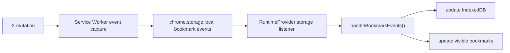
```mermaid
flowchart LR
  X["X mutation"] --> SW["Service Worker event capture"]
  SW --> CS["chrome.storage.local bookmark events"]
  CS --> RP["RuntimeProvider storage listener"]
  RP --> STORE["handleBookmarkEvents()"]
  STORE --> DB["update IndexedDB"]
  STORE --> UI["update visible bookmarks"]
```

### Important detail

Bookmark event ingestion is orthogonal to the sync lifecycle. It never touches `lastFullSyncAt`, never reserves a lease, and never writes to SW-owned cache-summary keys. The event-driven flow mutates IDB directly and relies on the SW's reservation lifecycle to handle real sync runs.

## 9. Detail Cache and Reader Flow

Bookmarks alone are not enough for offline reading. The reader and prefetch loop both contribute to the same detail-cache index.

### Reader flow (loader-shaped)

The reader route calls `useReaderDetail(tweetId)` — a hook with the same shape as a router loader:

```ts
type ReaderDetailState =
  | { status: "idle" }
  | { status: "pending"; tweetId: string }
  | { status: "success"; tweetId: string; data: TweetDetailContent }
  | { status: "error";   tweetId: string; error: string };
```

Stale-response cancellation is encoded in a pure reducer, not in a `cancelled` flag. A late `resolved` / `error` event whose `tweetId` doesn't match the currently-pending `tweetId` collapses to a no-op (see §16 Invariant #8).

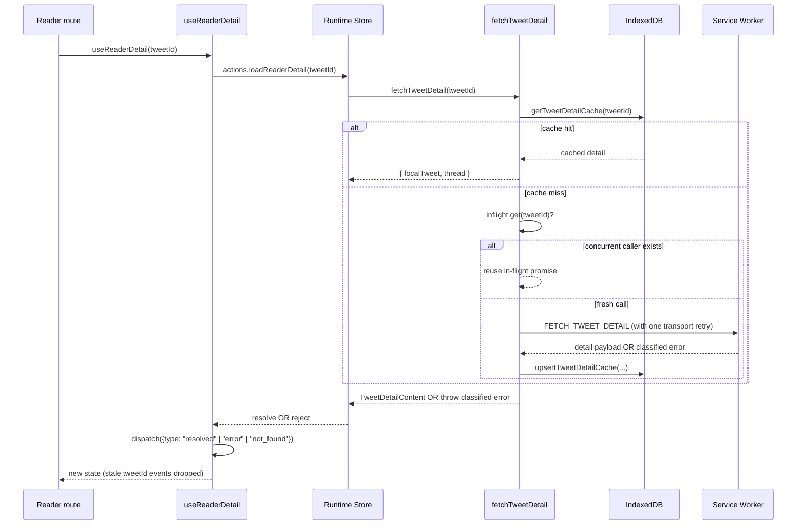
```mermaid
sequenceDiagram
  participant UI as Reader route
  participant Hook as useReaderDetail
  participant Store as Runtime Store
  participant API as fetchTweetDetail
  participant DB as IndexedDB
  participant SW as Service Worker

  UI->>Hook: useReaderDetail(tweetId)
  Hook->>Store: actions.loadReaderDetail(tweetId)
  Store->>API: fetchTweetDetail(tweetId)
  API->>DB: getTweetDetailCache(tweetId)
  alt cache hit
    DB-->>API: cached detail
    API-->>Store: { focalTweet, thread }
  else cache miss
    API->>API: inflight.get(tweetId)?
    alt concurrent caller exists
      API-->>API: reuse in-flight promise
    else fresh call
      API->>SW: FETCH_TWEET_DETAIL (with one transport retry)
      SW-->>API: detail payload OR classified error
      API->>DB: upsertTweetDetailCache(...)
    end
  end
  API-->>Store: TweetDetailContent OR throw classified error
  Store-->>Hook: resolve OR reject
  Hook->>Hook: dispatch({type: "resolved" | "error" | "not_found"})
  Hook-->>UI: new state (stale tweetId events dropped)
```

`actions.detailCached(tweetId)` updates the in-memory `detailedTweetIds` set immediately so offline filtering stays correct without waiting for a later refresh. The in-flight Map in `fetchTweetDetail` ensures reader + prefetch don't fire duplicate requests for the same tweetId (§16 Invariant #7).

### Reader error classification

Every error surface gives the user an action that resolves *that specific* error. A new terminal error code from the SW cannot silently fall back to a generic Retry — `classifyDetailError` has a module-load assertion forcing every code in `TERMINAL_ERROR_CODES` to map to a kind (§16 Invariant #5).

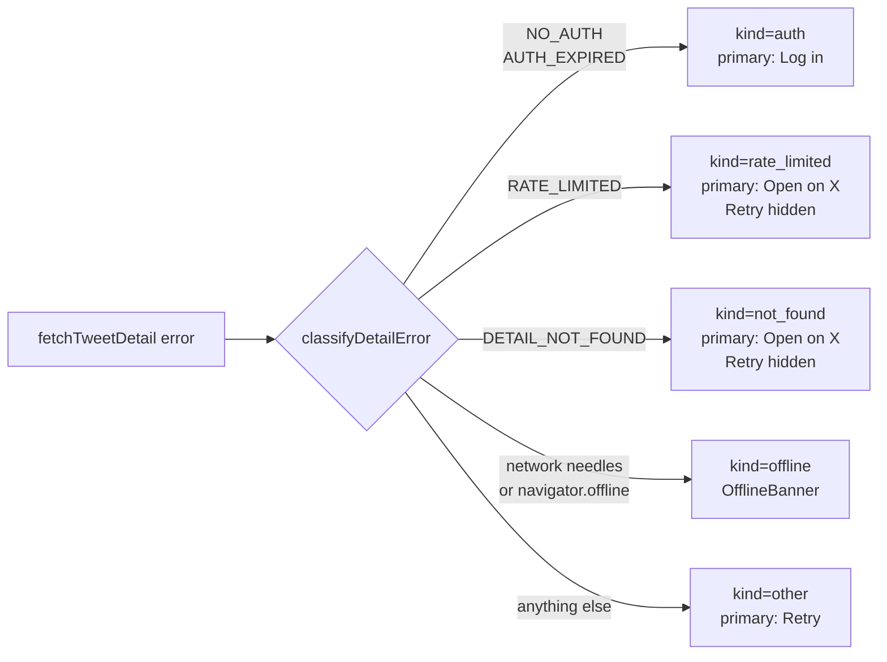
```mermaid
flowchart LR
  Fetch["fetchTweetDetail error"] --> Classify{classifyDetailError}
  Classify -->|NO_AUTH<br/>AUTH_EXPIRED| Auth["kind=auth<br/>primary: Log in"]
  Classify -->|RATE_LIMITED| Rate["kind=rate_limited<br/>primary: Open on X<br/>Retry hidden"]
  Classify -->|DETAIL_NOT_FOUND| NF["kind=not_found<br/>primary: Open on X<br/>Retry hidden"]
  Classify -->|network needles<br/>or navigator.offline| Off["kind=offline<br/>OfflineBanner"]
  Classify -->|anything else| Other["kind=other<br/>primary: Retry"]
```

### Offline-readable bookmarks

When the app is offline or reconnecting, visible bookmarks are restricted to bookmarks with cached details:

- online: show all bookmarks
- offline/connecting/reauthing: show only bookmarks whose `tweetId` exists in `detailedTweetIds`

## 10. Prefetch Controller

Prefetch loop mechanics live in `src/stores/prefetch-controller.ts`, not inside the store itself.

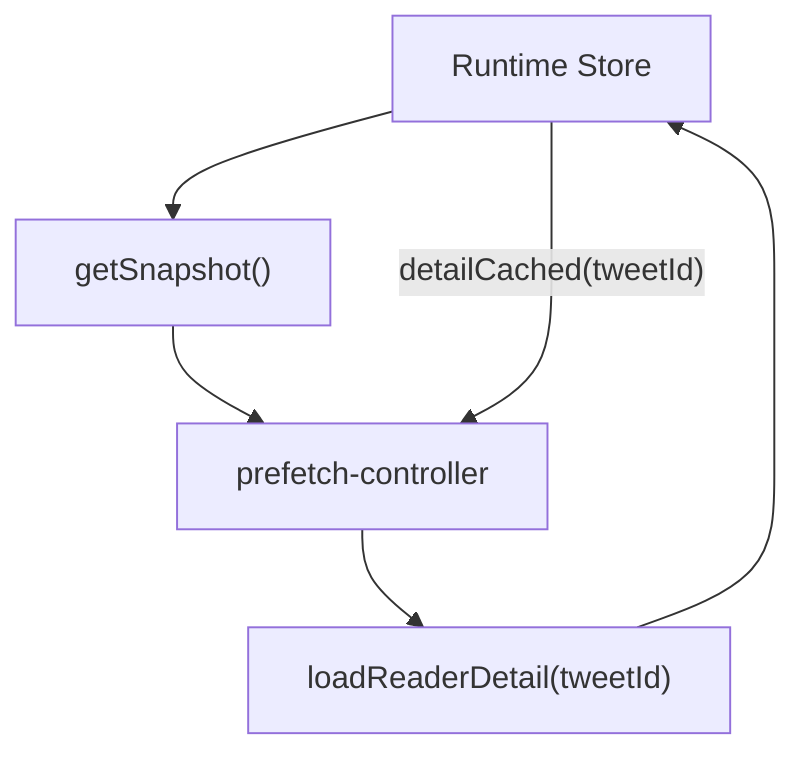
```mermaid
flowchart TD
  Store["Runtime Store"] --> Snapshot["getSnapshot()"]
  Snapshot --> Prefetch["prefetch-controller"]
  Prefetch --> Detail["loadReaderDetail(tweetId)"]
  Detail --> Store
  Store -->|"detailCached(tweetId)"| Prefetch
```

### Prefetch rules

- only runs when runtime mode is `online_ready`
- pauses while reader is active
- prioritizes a small top-of-list pool
- continues after item-level failures
- updates `prefetchStatus` as `idle`, `running`, or `paused`

## 11. Persistence

### IndexedDB

Totem uses account-scoped databases.

| Store | Purpose |
|---|---|
| `bookmarks` | synced bookmark metadata |
| `tweet_details` | full reader payload for offline reading |
| `reading_progress` | resume position + completion |
| `highlights` | saved highlights and notes |

Database naming:

- default DB: `totem`
- account DB: `totem_acct_<accountId>`

The runtime store calls `setActiveAccountId(accountContextId)` before hydration so it opens the correct database.

### chrome.storage.local (split by writer)

Keys are split across two files so a compile-time / test-time boundary separates SW-owned writes from runtime-owned writes:

**`src/lib/storage-keys.ts`** — shared constants, read by anyone, written by their respective owners:

- `CS_AUTH_HEADERS`, `CS_AUTH_STATE`, `CS_AUTH_TIME` — written by SW (webRequest capture)
- `CS_USER_ID`, `CS_ACCOUNT_CONTEXT_ID` — written by SW from twid cookie
- `CS_BOOKMARK_EVENTS` — written by SW (event capture)
- `CS_DB_CLEANUP_AT`, `CS_RUNTIME_AUDIT` — written by runtime
- `CS_LAST_RECONCILE`, `CS_SYNC_AUTO_ENABLED` — legacy/telemetry

**`src/service-worker/storage-keys-sw.ts`** — SW-exclusive writers. Physical file boundary enforced by a source-grep test:

- `CS_SYNC_ORCHESTRATOR_STATE` — lease + cooldown + `lastFullSyncAt`
- `CS_RUNTIME_STATE_V2` — full `RuntimeSnapshot`
- `CS_LAST_SYNC`, `CS_LAST_SOFT_SYNC` — cache-summary timestamps
- `CS_SOFT_SYNC_NEEDED` — soft-sync hint

Only two runtime files are allowed to *import* from `storage-keys-sw`: `lib/reset.ts` (wipes them) and `runtime/RuntimeProvider.tsx` (matches change events). See §16 Invariant #1 and §17.

### localStorage

Used sparingly for app-local state: reading tab, sorts, wallpaper, pinned tweets, reader activity. **No `totem_boot_sync_policy`** — that key was removed in Phase 1. Legacy cleanup still lists it in `LEGACY_LOCAL_STORAGE_KEY_MAP` so existing users' localStorage is scrubbed on first reset after upgrade.

## 11.5. Reactive SW → UI Snapshot Push

The SW owns `RuntimeSnapshot`. When it persists a new one to `CS_RUNTIME_STATE_V2`, the runtime picks it up *reactively* — not by polling on the next heartbeat — through a `chrome.storage.onChanged` subscription.

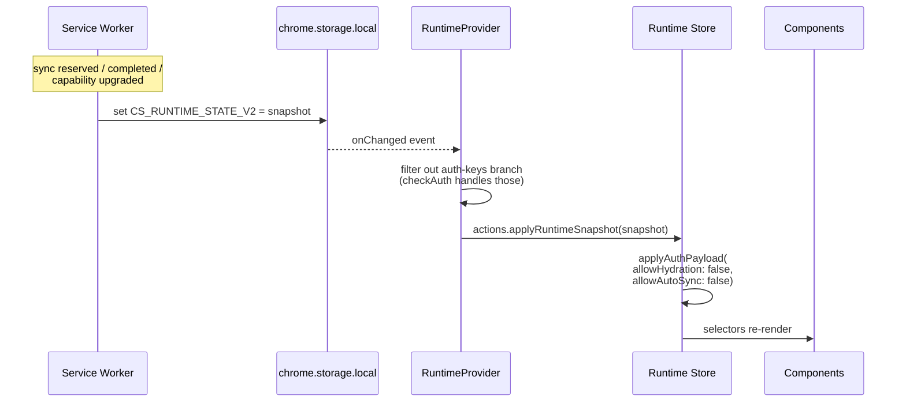
```mermaid
sequenceDiagram
  participant SW as Service Worker
  participant Storage as chrome.storage.local
  participant RP as RuntimeProvider
  participant Store as Runtime Store
  participant UI as Components

  Note over SW: sync reserved / completed /<br/>capability upgraded
  SW->>Storage: set CS_RUNTIME_STATE_V2 = snapshot
  Storage-->>RP: onChanged event
  RP->>RP: filter out auth-keys branch<br/>(checkAuth handles those)
  RP->>Store: actions.applyRuntimeSnapshot(snapshot)
  Store->>Store: applyAuthPayload(<br/>  allowHydration: false,<br/>  allowAutoSync: false)
  Store->>UI: selectors re-render
```

**What this replaces:** before Phase 3, the runtime only re-read the SW snapshot on the next heartbeat (45 s) or next `checkAuth()`. A capability upgrade mid-session (e.g., a query ID discovered 2 s after the extension opened) was invisible to the UI until the next heartbeat. Now it propagates on the same event loop tick.

**Guardrails:**

- `applyRuntimeSnapshot` passes `allowHydration: false, allowAutoSync: false` — a push never re-reads IDB and never starts a sync. It only updates auth/capability/session mirrors from the snapshot.
- If a push snapshot flips the session to non-ready mid-sync, `applyAuthPayload` releases the active lease through the SW (`shouldReleaseActiveWork` in §16 Invariant #3). A sync can never outlive its session.
- The listener skips the snapshot branch when an auth-keys change fires in the same batch — `checkAuth()` will re-fetch and apply the same data. Avoids double-work.

## 12. Reset Flow

Reset is an **atomic RPC** — the runtime blocks on the SW's ack before touching IDB, so no in-flight sync can write to a database that's about to be deleted.

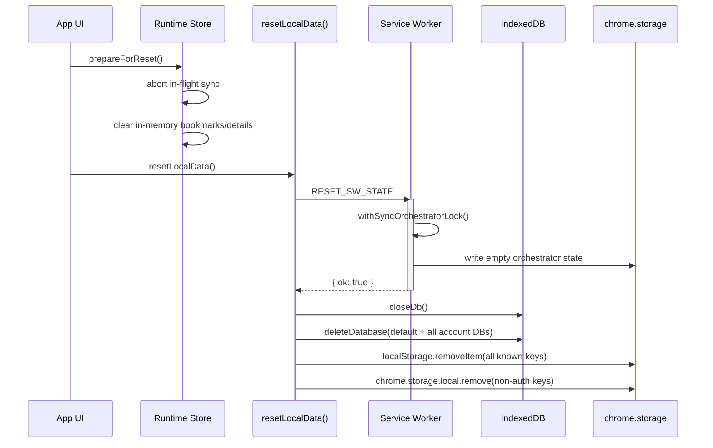
```mermaid
sequenceDiagram
  participant UI as App UI
  participant Store as Runtime Store
  participant Reset as resetLocalData()
  participant SW as Service Worker
  participant DB as IndexedDB
  participant CS as chrome.storage

  UI->>Store: prepareForReset()
  Store->>Store: abort in-flight sync
  Store->>Store: clear in-memory bookmarks/details
  UI->>Reset: resetLocalData()
  Reset->>SW: RESET_SW_STATE
  activate SW
  SW->>SW: withSyncOrchestratorLock()
  SW->>CS: write empty orchestrator state
  SW-->>Reset: { ok: true }
  deactivate SW
  Reset->>DB: closeDb()
  Reset->>DB: deleteDatabase(default + all account DBs)
  Reset->>CS: localStorage.removeItem(all known keys)
  Reset->>CS: chrome.storage.local.remove(non-auth keys)
```

### Reset goals

- Keep auth capture when possible so login recovery is cheaper.
- Clear local bookmark/detail/progress/highlight state.
- **No runtime "am I reset" flag** — the next boot's `lastFullSyncAt === 0` fully describes the post-reset state; the self-heal handles it (§6).
- The ack handshake prevents silent DB corruption from in-flight writes.

## 13. Component Rendering Rules

The main app-level rule is simple:

> Components render from selector answers, not by reconstructing runtime truth locally.

Examples:

- `NewTabHome` uses `useFooterState()` and `useSyncButtonState()`
- `BookmarksList` uses the same sync selectors as the home screen
- `BookmarkReader` uses `useReaderAvailabilityState()`
- bookmark lists use `useDisplayBookmarks()`

This keeps home, reading list, and reader aligned.

## 14. Key Files

### Runtime and UI state

- `src/stores/runtime-store.ts` — single source of truth for UI-facing runtime
- `src/stores/selectors.ts` — the only API components read from
- `src/runtime/RuntimeProvider.tsx` — effect shell + reactive snapshot subscription
- `src/stores/prefetch-controller.ts` — detail warmup loop
- `src/hooks/useReaderDetail.ts` — loader-shaped hook for the reader route

### Service worker and API boundary

- `src/service-worker/index.ts` (bundled → `public/service-worker.js`)
- `src/service-worker/auth.ts` — session/snapshot building
- `src/service-worker/sync.ts` — reservation/completion/reset handlers, self-heal mode
- `src/service-worker/api-proxy.ts` — tweet detail + bookmark mutation proxies
- `src/service-worker/query-id.ts` — GraphQL query-ID discovery
- `src/api/core/auth.ts`, `bookmarks.ts`, `posts.ts`, `sync.ts` — runtime-side RPC wrappers

### Persistence

- `src/db/index.ts` — account-scoped IndexedDB
- `src/lib/reset.ts` — atomic reset with SW ack
- `src/lib/storage-keys.ts` — shared key constants (runtime + SW read this)
- `src/service-worker/storage-keys-sw.ts` — SW-owned key constants (non-SW imports forbidden; see §17)

### Sync helpers

- `src/lib/reconcile.ts`
- `src/lib/fetch-queue.ts`
- `src/lib/bookmark-event-plan.ts`

### Components

- `src/App.tsx` — route switch, reader route, error shell with classified actions
- `src/components/NewTabHome.tsx`
- `src/components/BookmarksList.tsx`
- `src/components/BookmarkReader.tsx`
- `src/components/reader/detail-error.ts` — classifier (module-load assertion forces exhaustive coverage)

### Invariant enforcement

- `src/lib/__tests__/storage-invariants.test.ts` — CI-enforced source-grep guards for Invariants #1 and #6. Red-team verified to fire on deliberate violations.

## 15. Mental Model

If you need one sentence for the whole system, use this:

> The service worker decides whether Totem is allowed to sync, IndexedDB remembers what Totem already knows, and the runtime store decides what the UI should show right now.

That split is the backbone of the current architecture.

## 16. Load-Bearing Invariants

These are the properties that a previous bug class ("loading loop after reset", "infinite Opening this post in Totem…" spinner) violated. The current architecture makes each of them unrepresentable. If future work re-violates one, the old class of bug comes back.

### Invariant 1: Single writer per persisted fact

Every piece of durable state has exactly one writer. Other processes read; they never mirror, predict, or cache their own copy.

| Fact | Writer | Readers |
|---|---|---|
| `lastFullSyncAt`, `lastIncrementalSyncAt`, sync orchestrator state | service worker | runtime store (via snapshot) |
| `totem_last_sync`, `totem_last_light_sync`, `totem_light_sync_needed` | service worker (on `COMPLETE_SYNC`) | runtime store (via `cacheSummary`) |
| `totem_runtime_state_v2` (full runtime snapshot) | service worker | runtime store (via `chrome.storage.onChanged` push) |
| account-scoped IndexedDB bookmarks, details, progress, highlights | runtime store | UI (via selectors) |

**How violations used to sneak in:** the runtime flipped `bootPolicy` to `auto` *before* confirming `completeSyncRun` on the SW. If the confirmation failed, the two sides drifted. Deleting `bootPolicy` entirely and making `lastFullSyncAt` the sole seeded-ness truth removed the ability to express that drift.

### Invariant 2: Seeded-ness is derived, never stored

"Has this account ever completed a full sync?" is `snapshot.accounts[accountId].lastFullSyncAt > 0`. Nothing else persists the boolean. The SW orchestrator self-heals by forcing `mode = "full"` whenever `lastFullSyncAt <= 0`, regardless of trigger or local bookmark count — so even if a previous install populated IDB before the SW was aware, one sync cycle reconciles.

### Invariant 3: Sync in-flight is bounded by ready-state

Whenever the runtime's session view transitions away from `ready` — whether via hydration, auth-check refresh, or a pushed snapshot — `stopSync()` and `releaseActiveLease("skipped")` fire. A sync run cannot outlive the session it started in. This is what prevents a sync from writing into a DB the runtime no longer owns.

**Guarded at:** `applyAuthPayload` in `src/stores/runtime-store.ts`. The single gate is:

```ts
const shouldReleaseActiveWork =
  needsHydration ||
  (state.syncStatus === "syncing" && phase !== "ready");
```

### Invariant 4: UI never gates on `appMode === "initializing"`

The reader route used to have `if (appMode === "initializing") return;` silently in its fetch effect. If the runtime ever stuck in `initializing`, the reader spun forever. That guard is gone. The reader's fetch runs whenever a tweetId is present. Loading / ready / error are the only three states the UI renders — no dead-end guards.

### Invariant 5: Every error screen has an action that resolves its own error

`classifyDetailError` distinguishes `auth | rate_limited | not_found | offline | other`. Each kind maps to a distinct message and a distinct primary action in `ExternalReaderShell`:

| Kind | Primary action | Retry shown? |
|---|---|---|
| `auth` | Log in | Yes (secondary) |
| `rate_limited` | Open on X | No (Retry is futile under cooldown) |
| `not_found` | Open on X | No (tweet is gone) |
| `offline` | OfflineBanner (Log in CTA) | Handled by banner |
| `other` | Retry | Yes (primary) |

If a new terminal error code is added to `TERMINAL_ERROR_CODES` in `src/api/core/posts.ts` without being classified in `src/components/reader/detail-error.ts`, the classifier throws at module load. A new code cannot silently fall back to "other" — which would reintroduce the dead-end error screen.

### Invariant 6: Retry is for transport failures, never for server classifications

`fetchTweetDetail` retries exactly once, and only when `chrome.runtime.sendMessage` itself throws (MV3 service worker was asleep). A structured error envelope from the SW — `NO_AUTH`, `AUTH_EXPIRED`, `RATE_LIMITED`, `DETAIL_NOT_FOUND` — propagates to the caller without a second round-trip. Retrying them would stack a second failing request on top of the first and delay the user reaching the action that actually resolves the error.

### Invariant 7: One in-flight fetch per (tweetId) across callers

The reader and the prefetch controller both call `fetchTweetDetail`. A module-level `inflight: Map<string, Promise<...>>` collapses concurrent calls for the same tweetId into a single sendMessage. The entry is removed on settle.

### Invariant 8: The reader hook is loader-shaped, not useEffect-shaped

`useReaderDetail(tweetId)` returns a discriminated union `{ status: "idle" | "pending" | "success" | "error", ... }` plus `refetch()`. Stale-response cancellation is encoded in a pure reducer (events whose tweetId doesn't match the pending tweetId are dropped). No `cancelled` flag, no `retryKey` counter, no three-setter success path. Promoting this to a router loader later is a rename, not a rewrite.

### Invariant 9: Reset is an atomic RPC to the service worker

`resetLocalData()` blocks on a `RESET_SW_STATE` ack before deleting IDB. The SW handler takes the orchestrator lock, wipes persisted orchestrator state, and acks inside the lock. There is no window where the runtime has deleted the DB but the SW is still mid-write. `totem_boot_sync_policy` is no longer preserved — nothing about the old mirror survives.

---

If you're editing code that touches any of these, and you find yourself undoing one, that's the signal to stop and rethink. These invariants exist because each one fixed a specific, user-visible, reproducible bug. Re-violating one brings that bug back.

## 17. Enforcement

Invariants #1, #5, and #6 are **enforced at test time** — violating one of them fails CI, not code review. The rest are convention + tests + documentation.

| # | Invariant | How it's enforced |
|---|---|---|
| 1 | Single writer per persisted fact | `storage-invariants.test.ts` source-greps for `chrome.storage.local.set/remove` of SW-owned keys from non-SW files. SW-owned keys live in `src/service-worker/storage-keys-sw.ts`; a second grep-test forbids imports of that file except from an explicit allowlist (`reset.ts`, `RuntimeProvider.tsx`). |
| 2 | Seeded-ness is derived, never stored | Convention. The state field and its persistence layer are both deleted. Reintroducing a mirror would require re-adding both. |
| 3 | Sync in-flight is bounded by ready-state | Behavioral tests in `runtime-store.test.ts` verify the release on `syncing → non-ready`. |
| 4 | UI never gates on `appMode === "initializing"` | Convention. The specific gate is removed; adding it back would require an explicit diff. |
| 5 | Every error screen has an action that resolves its own error | Module-load assertion `assertAllTerminalCodesClassified()` in `detail-error.ts` iterates `TERMINAL_ERROR_CODES` and throws at test-suite import time if any code isn't classified. Build-breaking. |
| 6 | Retry is for transport failures, never for server classifications | `storage-invariants.test.ts` source-greps for `try/catch/for/while` loops around `fetchTweetDetail` / `loadReaderDetail` outside `posts.ts`. |
| 7 | One in-flight fetch per tweetId | Behavioral tests in `api/__tests__/posts.test.ts` verify the dedup map collapses concurrent calls. |
| 8 | Reader hook is loader-shaped | Type-enforced: the discriminated union makes `.data` inaccessible in `pending` / `error` states. |
| 9 | Reset is an atomic RPC | Behavioral tests in `reset.test.ts` verify `RESET_SW_STATE` is sent and awaited before IDB delete. |

### Adding a new violation path

If you're adding something new that legitimately needs to write a SW-owned key, or legitimately needs to retry `fetchTweetDetail`, or legitimately needs to import from `storage-keys-sw.ts`, the right move is to update the `ALLOWED_*` list in `storage-invariants.test.ts` with a comment explaining why — not to bypass the grep. The allowlist is intentionally visible so the decision is reviewable in a single diff.
