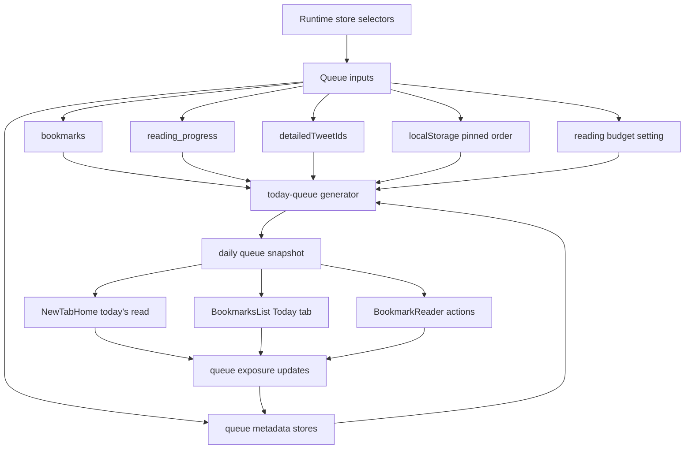
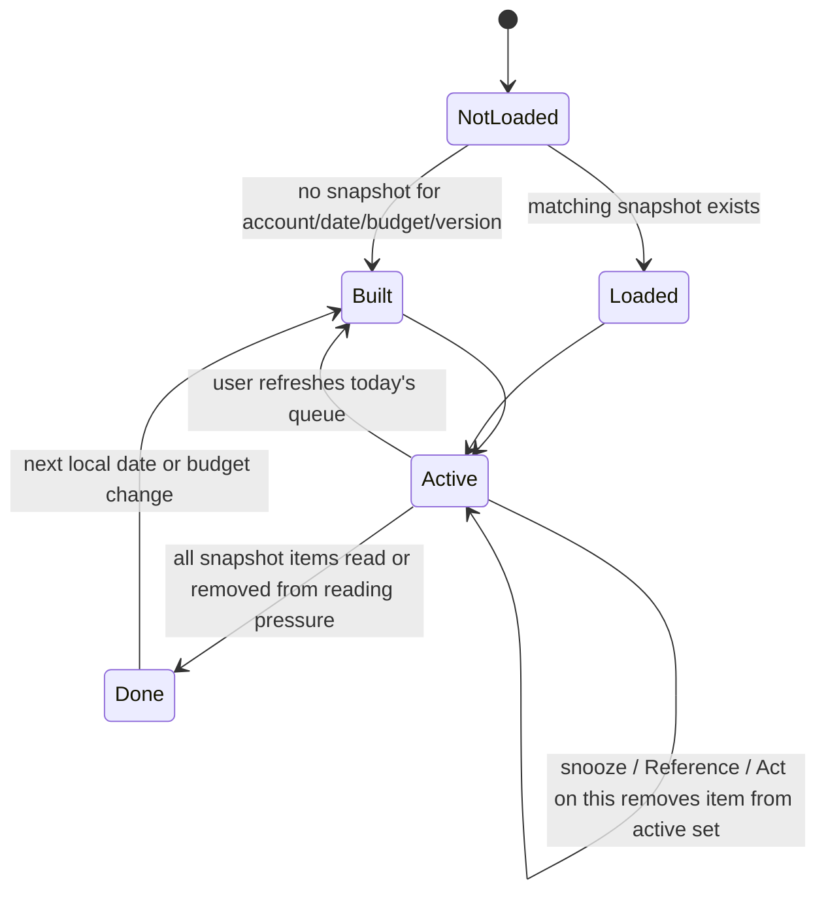

# feat: Add Today's Queue

## Summary

Build Today's Queue as Totem's local-first daily reading loop: a stable set of suggested X bookmarks for the current account, local date, and reading budget. The queue should drive the new-tab recommendation card, add a Today view to the reading list, and give users explicit feedback controls without adding AI, backend services, or automatic read heuristics.

---

## Problem Frame

Totem already syncs X bookmarks into an offline reading app, but the home card still picks a random or pinned item and the reading list still makes the user choose from the full backlog. The origin PRD frames the product shift as "Your X bookmarks, turned into today's reading" and asks for a bounded daily queue that lets users finish a small set without seeing the whole archive as a guilt number.

The current codebase has the right foundation: account-scoped IndexedDB stores bookmarks, tweet details, reading progress, and highlights; runtime selectors keep offline-readable content aligned; pins and reading list preferences live in localStorage; the reader writes explicit progress rows. Today's Queue should extend those local patterns instead of introducing server state or service-worker-owned mirrors.

---

## Requirements

**Queue Behavior**

- R1. Generate a bounded daily queue from unread, in-progress, pinned, recent, and neglected bookmarks using deterministic local scoring.
- R2. Keep the queue stable for the active account, local date, reading budget, and queue version until the user explicitly refreshes it.
- R3. Exclude completed bookmarks and suppress snoozed, Reference, Act on this, over-exposed, and unreadable offline items where those facts apply.
- R4. Compose the default queue around five slots: in-progress, recent, pinned or prioritized, old neglected, and a high-score wildcard.
- R5. Respect a 5, 15, or 30 minute reading budget by preferring shorter items for low budgets and allowing longer threads or articles for larger budgets.
- R6. Avoid duplicate tweet IDs and avoid a queue dominated by a single content type or author unless the candidate pool leaves no better mix.

**User Experience**

- R7. Make the new-tab card prefer Today's Queue and label it as today's read when an active queue item exists.
- R8. Add a Today view to the reading list that shows queue progress, queue items, and a done-for-today state when the queue is cleared.
- R9. Let users mark queue items read, snooze them, mark them Reference, mark them Act on this, and pin or unpin them from list and reader surfaces.
- R10. Treat Read, Snooze, Reference, Act on this, Pin, and unfinished opens as future suggestion signals without silently marking completion.
- R11. Keep the queue useful in offline cached mode by selecting only bookmarks whose detail is cached when the runtime is offline-restricted.
- R12. Let users change the reading budget without losing existing reading progress or bookmark metadata.

**Data and Privacy**

- R13. Store queue state, intent metadata, snooze state, and exposure history locally in the active account database or existing local settings stores.
- R14. Do not add AI scoring, summaries, telemetry, backend sync, billing, cloud accounts, or non-X bookmark sources in this version.
- R15. Preserve existing single-writer boundaries: runtime and IndexedDB may own queue facts, but service-worker-owned sync state must not gain a runtime mirror.

**Verification**

- R16. Test the queue generator with fixed inputs rather than asserting brittle weight constants.
- R17. Test home, Today view, reader feedback actions, offline filtering, and daily stability through externally visible behavior.

---

## Scope Boundaries

### In Scope

- Local queue generation and persistence for the active account.
- Reading budget selection for 5, 15, and 30 minute sessions.
- Intent metadata for Read soon, Reference, Act on this, and unset.
- Snooze and exposure history sufficient to keep bad suggestions from repeating.
- New-tab, reading-list, and reader integration.
- Reset, import/export, and migration awareness for new durable user metadata.

### Deferred to Follow-Up Work

- "Digest today's queue" Markdown export.
- Search-fed focused queues such as "today's AI reading".
- Action-focused queue surfaces for Act on this items.
- Tuning weights from real user feedback beyond local/debug inspection.
- Rich explanation UI for every scoring signal.

### Out of Scope

- AI summaries, AI ranking, or remote model calls.
- Cloud sync, email digests, Notion, Readwise, Sheets, Zotero, or Obsidian integrations.
- Automatic mark-as-read heuristics.
- Writer/composer features.
- Multi-platform bookmark sources.
- Server-side accounts, telemetry, or billing.

---

## High-Level Technical Design

### Queue Data Flow

### Queue Lifecycle

The persisted snapshot is an ordered set of tweet IDs. The active queue is derived from that snapshot plus current suppression facts, so reading or snoozing an item removes it without reshuffling the rest of the day.

---

## Key Technical Decisions

- KTD1. Use account-scoped IndexedDB for queue metadata: Queue snapshots, bookmark intent, snooze dates, and exposure history are account-local reading facts, like progress and highlights. Keeping them in IndexedDB preserves offline behavior and avoids `chrome.storage.local` sync-state ownership issues.
- KTD2. Keep generation pure and deterministic: The scoring/composition module should accept plain inputs and return ordered queue items. This makes tests stable and keeps weight tuning isolated from React and IDB.
- KTD3. Persist snapshots, derive active state: Store the generated order once per account/date/budget/version, then filter read, snoozed, Reference, and Act on this items at render time. This satisfies daily stability while letting user feedback immediately clear items.
- KTD4. Add `today` as the primary recommendation source: Extend the existing recommendation source setting rather than creating a hidden parallel feature flag. Existing pinned/random behavior remains available as fallback and user choice.
- KTD5. Treat reading budget as a setting, not queue state: Store the selected 5/15/30 minute budget with existing user settings so home and reading-list surfaces agree. The queue snapshot key includes the budget so changing it intentionally creates a new daily queue.
- KTD6. Update export/import for durable intent metadata, not ephemeral queue snapshots: Reference, Act on this, Read soon, and snooze are user-created reading metadata and should be portable. Daily snapshots and exposure counts can remain local heuristics unless a later export format explicitly needs them.
- KTD7. Do not use service-worker state for queue behavior: The service worker owns auth, capability, sync admission, and runtime snapshots. Today's Queue should read runtime selectors and IndexedDB only.

---

## Implementation Units

### U1. Persist Today's Queue Metadata

**Goal:** Add account-scoped storage for queue snapshots, bookmark intent, snooze state, and exposure history.

**Requirements:** R2, R3, R10, R13, R15

**Dependencies:** None

**Files:**

- `src/types/index.ts`
- `src/lib/constants/db.ts`
- `src/db/index.ts`
- `src/lib/reset.ts`
- `src/db/__tests__/today-queue-db.test.ts`
- `src/lib/__tests__/reset.test.ts`
- `src/lib/__tests__/storage-invariants.test.ts`

**Approach:** Add typed records for bookmark queue metadata and daily queue snapshots. Bump the IndexedDB version and create stores with keys that let the app read the current day snapshot, look up metadata by tweet ID, and summarize recent exposure by tweet ID. Keep reset-app-state behavior preserving user-authored metadata while full delete removes it with the account database.

**Patterns to Follow:** `src/db/index.ts` for store creation and batch helpers; `src/lib/reset.ts` for preserving user-generated stores during app-state reset; `src/lib/__tests__/storage-invariants.test.ts` for protecting service-worker ownership boundaries.

**Test Scenarios:**

- Creating a fresh database at the new version creates queue metadata stores without disturbing existing bookmark, detail, progress, highlight, saved-search, or search-index stores.
- Reading a missing daily queue returns no snapshot rather than throwing.
- Upserting bookmark intent and snooze metadata can be read back by tweet ID.
- Recording exposure history deduplicates or bounds rows according to the chosen storage shape.
- Reset with `keepUserContent: true` preserves intent and snooze metadata while clearing transient bookmark/detail/search cache.
- Full reset still deletes account-scoped queue metadata with the database.
- Source-grep invariants still pass with no unauthorized import or write of service-worker-owned storage keys.

**Verification:** Queue metadata survives normal app reloads in the active account database and does not introduce a new runtime writer for service-worker-owned facts.

### U2. Implement Deterministic Queue Generation

**Goal:** Build the pure scoring and composition module that produces a stable daily queue from local inputs.

**Requirements:** R1, R3, R4, R5, R6, R10, R11, R16

**Dependencies:** U1

**Files:**

- `src/lib/today-queue.ts`
- `src/lib/constants/scoring.ts`
- `src/lib/__tests__/today-queue.test.ts`

**Approach:** Create a pure generator that accepts bookmarks, reading progress, pinned order, metadata, exposure history, cached-detail IDs, budget, account ID, local date, and queue version. Score candidates with clear signals, then fill named composition slots before applying deterministic tie-breaks and diversity checks. Use a seeded deterministic shuffle or hash-based tie-breaker, never `Math.random`.

**Patterns to Follow:** `src/lib/reading-list.ts` for pure sort helpers; `src/lib/related.ts` for lightweight scoring style; `src/lib/bookmark-utils.ts` for reading-time and content-kind helpers.

**Test Scenarios:**

- Same account, local date, budget, queue version, and corpus returns the same ordered queue across calls.
- Changing account, local date, budget, or queue version can return a different queue.
- Completed bookmarks are excluded.
- Future-snoozed bookmarks are excluded until the snooze date.
- Reference and Act on this items are suppressed from the normal reading queue.
- In-progress and pinned unread items are prioritized when present.
- Recent saves receive a temporary freshness boost.
- Older unread items with no recent exposure can resurface.
- Low budget prefers short posts over long threads when both are available.
- Offline-restricted generation excludes items without cached detail.
- Duplicate tweet IDs never appear in the result.
- Queue length stays at the configured size or smaller when the candidate pool is insufficient.
- Diversity logic prevents avoidable all-same-author or all-same-kind queues.

**Verification:** The generator is deterministic under fixed inputs and all PRD selection rules are covered without asserting exact internal weight constants.

### U3. Add Queue Hook and Settings Integration

**Goal:** Expose Today's Queue to the app as derived local state with refresh, budget, and feedback actions.

**Requirements:** R2, R5, R10, R12, R13

**Dependencies:** U1, U2

**Files:**

- `src/hooks/useTodayQueue.ts`
- `src/hooks/useSettings.ts`
- `src/components/SettingsModal.tsx`
- `src/types/index.ts`
- `src/hooks/__tests__/useTodayQueue.test.ts`
- `src/components/__tests__/settings-ui.test.tsx`

**Approach:** Add a hook or small state module that loads the matching daily snapshot, builds it when absent, derives active queue rows from current bookmarks/progress/metadata, and exposes actions for refresh, snooze, intent changes, and exposure recording. Extend settings with `recommendationSource: "today"` and a 5/15/30 minute queue budget. Keep the hook fed by `useAllBookmarks`, `useContinueReading`, `useDetailedTweetIds`, active account ID, pins, and metadata reads.

**Patterns to Follow:** `src/hooks/useContinueReading.ts` for joining persisted rows to bookmarks and subscribing to reader activity; `src/hooks/useSettings.ts` for normalized settings; `src/lib/pins.ts` for same-tab and cross-tab local updates.

**Test Scenarios:**

- The hook reads an existing snapshot for the same date and budget instead of regenerating.
- The hook generates and persists a snapshot when none exists.
- Changing budget selects the matching budget snapshot or builds a new one.
- Manual refresh replaces today's snapshot and records fresh exposure.
- Read, snoozed, Reference, and Act on this items are absent from the active queue derived from a persisted snapshot.
- Normalizing older settings without a queue budget uses the default budget.
- Normalizing older settings without a `today` recommendation source keeps valid pinned/random values and defaults invalid or missing values to today.

**Verification:** Home and reading list can consume one shared queue model rather than duplicating generation logic.

### U4. Make the New Tab Card Use Today's Queue

**Goal:** Turn the new-tab recommendation card into the primary today's read surface.

**Requirements:** R7, R10, R11, R17

**Dependencies:** U3

**Files:**

- `src/components/NewTabHome.tsx`
- `src/App.tsx`
- `src/components/__tests__/new-tab-today-queue.test.tsx`

**Approach:** Pass the current queue state into `NewTabHome` and prefer the first active queue item when the recommendation source is today. Label the card "today's read" and show queue progress where it fits without crowding the compact home surface. Keep pinned and random recommendation modes working as explicit fallbacks. Treat "Surprise me" as a non-queue fallback action rather than a daily queue reshuffle.

**Patterns to Follow:** Existing `NewTabHome` footer card states, `useFooterState`, and offline card behavior; `src/components/__tests__/growth-ui.test.tsx` for static component rendering tests.

**Test Scenarios:**

- Home card renders the first active queue item and today's-read label when queue mode is active.
- Home falls back to pinned or random behavior when the user selects those recommendation sources.
- Home shows done-for-today copy instead of a generic empty backlog message when the daily queue is cleared and unread bookmarks still exist.
- Offline mode only surfaces queue items whose details are cached.
- Opening the home card records queue exposure/open feedback without marking the item read.

**Verification:** The new tab offers one clear next read from Today's Queue and preserves existing fallback recommendation behavior.

### U5. Add the Today View to the Reading List

**Goal:** Add a Today tab that shows the queue, progress, refresh, budget controls, and done state.

**Requirements:** R8, R9, R10, R12, R17

**Dependencies:** U3

**Files:**

- `src/lib/reading-list.ts`
- `src/components/BookmarksList.tsx`
- `src/App.tsx`
- `src/lib/__tests__/reading-list.test.ts`
- `src/components/__tests__/bookmarks-list-today.test.tsx`

**Approach:** Extend `ReadingTab` with `today`, validate stored tabs, and make Today the preferred reading-list entry when a queue exists. Render queue rows in persisted order with progress count, reading budget control, and refresh action. Keep global search scopes focused on all/unread/reading/read for now; search-fed queues are deferred.

**Patterns to Follow:** `BookmarksList` tab handling, virtualized row rendering, pinned card rendering, and sort preference persistence; Base UI Tabs and Select components already used in the file.

**Test Scenarios:**

- Stored `today` tab is accepted and invalid stored tabs fall back safely.
- Today tab count reflects active queue items, not the whole unread backlog.
- Today rows render in queue order rather than unread sort order.
- Done-for-today state appears after every queue item is read, snoozed, Reference, or Act on this.
- Refresh queue action replaces today's snapshot only after explicit user action.
- Budget changes persist and rebuild the displayed queue for that budget.
- Existing unread, reading, read, pinned, and search behaviors remain unchanged outside Today mode.

**Verification:** Users can open the reading list and see today's bounded work before the full archive.

### U6. Wire Reader and Row Feedback Actions

**Goal:** Let user actions update future suggestions from the row and reader surfaces.

**Requirements:** R3, R9, R10, R13, R17

**Dependencies:** U1, U3, U5

**Files:**

- `src/components/BookmarkReader.tsx`
- `src/components/reader/TweetContent.tsx`
- `src/components/BookmarksList.tsx`
- `src/App.tsx`
- `src/lib/pins.ts`
- `src/components/__tests__/reader-queue-actions.test.tsx`
- `src/components/__tests__/bookmarks-list-today.test.tsx`

**Approach:** Add compact queue actions for Snooze, Reference, Act on this, and Pin near existing read/unbookmark controls. Use explicit user clicks to update queue metadata. Marking read continues to use `markReadingProgressCompleted`; queue code observes progress and clears the item. Snooze should remove the item from the active queue immediately and set a future date. Reference and Act on this should remove normal daily reading pressure.

**Patterns to Follow:** Existing `bookmarkAction` and `onToggleRead` patterns in `BookmarkReader`; existing pin controls and toast behavior in `BookmarksList`; Phosphor icons and Base UI primitives already present in UI code.

**Test Scenarios:**

- Mark read updates reading progress and removes the item from the active queue without changing the persisted queue order.
- Mark unread can make an item eligible again according to current metadata and snapshot rules.
- Snooze removes the item from today and keeps it suppressed until the selected date.
- Reference removes the item from daily reading pressure and persists across reload.
- Act on this removes the item from the normal queue and persists across reload.
- Pin toggling still respects the existing unread pin cap and boosts future queue generation.
- Reader actions and list row actions produce the same metadata state.

**Verification:** Every feedback action changes future suggestions through local metadata and never relies on hidden completion heuristics.

### U7. Keep Local Data Portability and Maintenance Coherent

**Goal:** Update import/export, reset, and documentation touchpoints for the new durable user metadata.

**Requirements:** R13, R14, R15, R17

**Dependencies:** U1, U6

**Files:**

- `src/lib/export/quick-export.ts`
- `src/lib/import/run-import.ts`
- `src/components/ImportModal.tsx`
- `src/components/SettingsModal.tsx`
- `src/lib/import/__tests__/run-import.test.ts`
- `src/lib/export/__tests__/quick-export.test.ts`
- `docs/regression-tests.md`
- `ARCHITECTURE.md`

**Approach:** Include durable bookmark intent and snooze metadata in the export/import schema so local-first user decisions survive device moves. Keep daily queue snapshots and exposure history out of export unless implementation reveals they are needed for user-visible continuity. Update reset copy and architecture docs to name the new IndexedDB stores and ownership rules.

**Patterns to Follow:** Existing JSONL shard export/import design in `quick-export.ts` and `run-import.ts`; reset copy in `SettingsModal`; `ARCHITECTURE.md` persistence and invariant sections.

**Test Scenarios:**

- Export manifest includes the new durable metadata shard and checksum when metadata exists.
- Import accepts valid metadata rows and rejects malformed rows without failing unrelated stores.
- Import remains backward-compatible with older exports that lack queue metadata.
- Export/import account mismatch behavior remains unchanged.
- Settings reset copy includes queue intent/snooze metadata as personal content.
- Architecture docs continue to describe one writer per persisted fact.

**Verification:** User-authored queue metadata is treated like other local-first personal content without making ephemeral recommendation history part of the portable data contract.

### U8. End-to-End Verification and Rollout Hardening

**Goal:** Verify the full daily queue loop across local state, offline mode, and existing product invariants.

**Requirements:** R1 through R17

**Dependencies:** U1, U2, U3, U4, U5, U6, U7

**Files:**

- `src/lib/__tests__/today-queue.test.ts`
- `src/db/__tests__/today-queue-db.test.ts`
- `src/components/__tests__/new-tab-today-queue.test.tsx`
- `src/components/__tests__/bookmarks-list-today.test.tsx`
- `src/components/__tests__/reader-queue-actions.test.tsx`
- `src/lib/__tests__/storage-invariants.test.ts`
- `docs/regression-tests.md`

**Approach:** Add or update focused tests around the behavior slices instead of one broad brittle UI test. Use fake IndexedDB for persistence, pure helpers for generator behavior, and static React rendering for component-visible copy and control presence where existing test tooling supports it. Record manual QA scenarios in the regression checklist for extension surfaces that static tests cannot fully exercise.

**Patterns to Follow:** Current Vitest structure under `src/lib/__tests__`, `src/db/__tests__`, `src/components/__tests__`, and fake IndexedDB usage in import/export tests.

**Test Scenarios:**

- Full flow: generate queue, show first item on home, open it, mark it read, return to home, and see the next active queue item.
- Full flow: snooze a home/list item and verify it disappears today without changing read progress.
- Full flow: mark Reference and verify it leaves Today and future normal queues.
- Offline cached flow: queue excludes uncached details and still works when runtime restricts display bookmarks.
- Stability flow: sync adds new bookmarks after today's queue exists and the active queue does not reshuffle until refresh.
- Regression flow: existing reading progress, pinned, search, import/export, reset, and storage-invariant tests still pass.

**Verification:** The feature ships with generator, persistence, UI, and invariant coverage that proves the daily queue loop works without regressing existing offline reading behavior.

---

## System-Wide Impact

- IndexedDB schema version increases, so migration must preserve every existing account-scoped store.
- Settings normalization changes because `recommendationSource` gains `today` and queue budget becomes a persisted setting.
- Import/export schema changes if durable queue metadata is made portable.
- Reading-list tab persistence changes because `today` becomes a valid tab.
- Home recommendation semantics change for users without an explicit pinned/random preference.
- Offline mode remains constrained by cached `tweet_details`; queue generation must respect `detailedTweetIds` when runtime selectors restrict readable bookmarks.

---

## Risks & Dependencies

- **Risk: queue metadata overreach.** Exposure history can become noisy or too durable. Mitigate by keeping only the history needed for cooldowns and exporting only user-authored metadata.
- **Risk: hidden product complexity.** Reference and Act on this introduce concepts without their future destination surfaces. Mitigate with simple labels and by treating them as pressure-removal actions in v1.
- **Risk: settings migration surprise.** Existing users may have implicit random recommendations. Mitigate by normalizing valid stored values unchanged while making today the default for missing or invalid settings.
- **Risk: stale daily snapshots.** A queued item can disappear from the bookmark store after an unbookmark or sync reconcile. Mitigate by deriving active queue rows from current bookmarks and dropping missing IDs at read time.
- **Risk: UI crowding.** Home and reader surfaces are compact. Mitigate with icon-based actions, menus where appropriate, and no explanatory feature copy inside the app.

---

## Acceptance Examples

- AE1. Given the user has unread, pinned, recent, and old neglected bookmarks, when Today's Queue is generated for June 8, 2026 with a 15 minute budget, then the queue contains at most five unique unread items in a stable order.
- AE2. Given a matching daily queue snapshot already exists, when the new tab reloads, then the same active queue order appears unless the user changes budget, the date changes, or the user refreshes the queue.
- AE3. Given the first queue item is marked read in the reader, when the user returns to the new tab, then the next active queue item is shown and the read item stays completed.
- AE4. Given a queue item is snoozed until a future date, when the user views Today before that date, then the item is absent from the active queue and not auto-replaced by a random item.
- AE5. Given the user is offline with cached details for only some bookmarks, when Today's Queue is generated, then only cached-readable bookmarks can be selected.
- AE6. Given all queue items are read, snoozed, Reference, or Act on this, when the user opens home or Today, then Totem shows a done-for-today state instead of the full unread backlog.

---

## Sources & Research

- `prds/todays-queue.md` is the origin document and product source of truth.
- `ARCHITECTURE.md` defines account-scoped IndexedDB, runtime selector, offline, prefetch, and single-writer invariants.
- `docs/prd-offline-first.md` explains why offline-readable bookmark surfaces must use cached detail availability.
- `src/db/index.ts` contains the existing IndexedDB schema and persistence helpers to extend.
- `src/hooks/useContinueReading.ts` contains the progress-to-bookmark join that Today should reuse.
- `src/components/NewTabHome.tsx` contains the current random/pinned recommendation behavior to replace with Today's Queue first.
- `src/components/BookmarksList.tsx` contains tab, search, sort, pinned, and row interaction patterns.
- `src/components/BookmarkReader.tsx` contains explicit read/unread and bookmark action wiring.
- `src/lib/export/quick-export.ts` and `src/lib/import/run-import.ts` define the current portable data contract.
- `src/lib/__tests__/storage-invariants.test.ts` protects the storage ownership constraints this plan must preserve.
